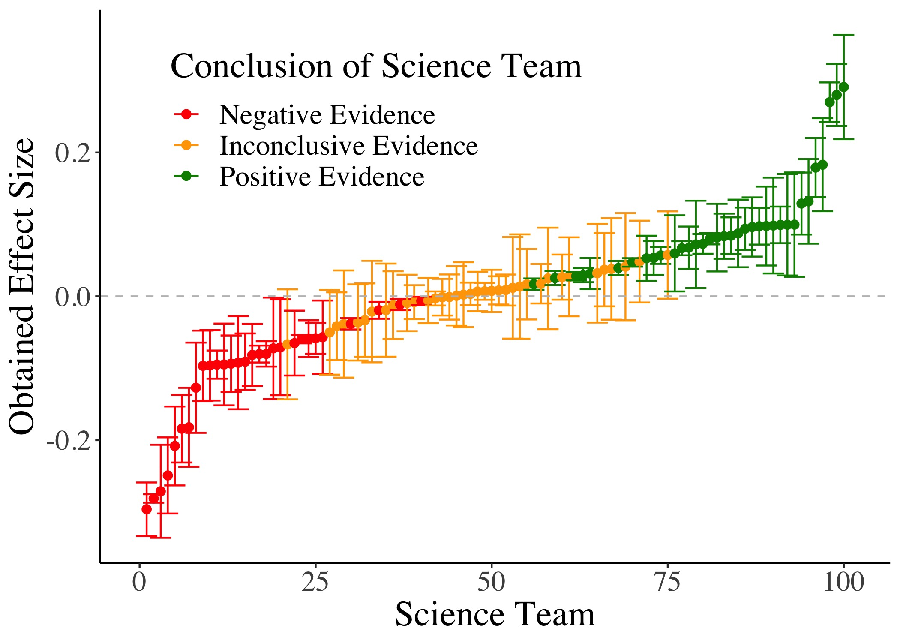
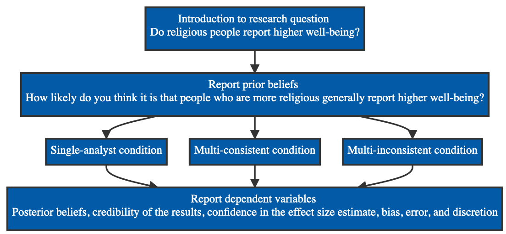

```{r setup, include=FALSE}
options(htmltools.dir.version = FALSE)
knitr::opts_chunk$set(
  fig.width=9, fig.height=3.5, fig.retina=3,
  out.width = "100%",
  cache = FALSE,
  echo = TRUE,
  message = FALSE, 
  warning = FALSE,
  hiline = TRUE
)
```

```{r xaringan-themer, include=FALSE, warning=FALSE}
library(tidyverse)
library(xaringanthemer)
library(xaringanExtra)
library(icons)
library(widgetframe)

style_duo(primary_color = "#ffffff", 
          secondary_color = "#035AA6")
```

```{r xaringan-tile-view, echo=FALSE}
xaringanExtra::use_tile_view()
```

```{r xaringan-panelset, echo=FALSE}
xaringanExtra::use_panelset()
```

```{r echo=FALSE}
xaringanExtra::style_panelset_tabs(
  active_foreground = "#035AA6",
  hover_foreground = "#d22"
 )
```

```{r xaringanExtra, echo = FALSE}
xaringanExtra::use_progress_bar(color = "#035AA6", location = "top")
```

```{r, echo = FALSE}
set.seed(1808)

estimates <- data.frame(
  Estimate = sample(
    x = c(seq(-0.3, 0.3, .001), seq(-0.1, 0.1, .0001)), 
    size = 100
    ),
  se = sample(
    x = seq(0.003, 0.04, .001),
    replace = TRUE,
    size = 100
  )) %>% 
  arrange(Estimate) %>% 
  mutate(Team = 1:100,
         Conclusion = case_when(
           Estimate - 1.96 * se < 0 & Estimate + 1.96 * se < 0 ~ "Negative Evidence",
           Estimate - 1.96 * se < 0 & Estimate + 1.96 * se > 0 ~ "Inconclusive Evidence",
           Estimate - 1.96 * se > 0 & Estimate + 1.96 * se > 0 ~ "Positive Evidence"
         )) %>% 
  mutate(Conclusion = factor(Conclusion,
                             levels = c("Negative Evidence",
                                        "Inconclusive Evidence",
                                        "Positive Evidence")))

title_plot <- ggplot(data = estimates, 
                     mapping = aes(x = Team, y = Estimate, color = Conclusion)) +
  geom_point(size = 2) +
  geom_errorbar(mapping = aes(ymin = Estimate - 1.96 * se, 
                              ymax = Estimate + 1.96 * se),
                width = 3) + 
  theme_classic() +
  geom_hline(yintercept = 0, linetype = "dashed", color = "grey") +
  labs(x = "Science Team", 
       y = "Obtained Effect Size",
       color = "Conclusion of Science Team") +
  scale_color_discrete(type = c("red", "orange", "green4")) +
  theme(legend.position = c(0.35, 0.8),
        text = element_text(size = 20, family = "serif"))

ggsave("talk/title_plot.jpg", title_plot, 
       width = 7, height = 5, units = "in")
```

# Lay Perceptions of Crowd-Scientific Findings

**The Risks of Variability and Lack of Consensus**  
[Shilaan Alzahawi](http://shilaan.rbind.io) & [Benoît Monin](https://www.gsb.stanford.edu/faculty-research/faculty/benoit-monin)

.pull-left[

]

.pull-right[
$~~$  


[`r icon_style(icons::fontawesome("twitter"), scale = 2, fill = "#035AA6")` $~~$ twitter.com/shilaan01](https://twitter.com/shilaan01)    
[`r icon_style(icons::fontawesome("globe"), scale = 2, fill = "#035AA6")` $~~$ shilaan.rbind.io](https://shilaan.rbind.io)     
[`r icon_style(icons::fontawesome("github"), scale = 2, fill = "#035AA6")` $~~$ github.com/shilaan](https://github.com/shilaan)  
[`r icon_style(icons::fontawesome("paper-plane"), scale = 2, fill = "#035AA6")` $~~$ shilaan@stanford.edu](mailto:shilaan@stanford.edu)

]

???

Hi, thank you for being here. Today  I'll present some recent findings on crowdsourcing data analysis that I've been working on in collaboration with my co-author Professor Benoit Monin. 

---
# Outline 

???

First, I'll share a brief open science statement and links to all the available materials. Then, I'll define crowd science.

--
`r icon_style(icons::fontawesome("lock-open"), scale = 2, fill = "#035AA6")` $~~$ [**Open Science Statement**](#openscience)   
--

`r icon_style(icons::fontawesome("users"), scale = 2, fill = "#035AA6")` $~$ [**Crowdsourcing Science**](#crowdscience) 

???

Then, I'll define crowd science and crowdsourced data analysis and introduce our question of interest, which is "does crowdsourcing data analysis improve lay perceptions of scientific findings?".
--

`r icon_style(icons::fontawesome("chart-bar"), scale = 2, fill = "#035AA6")` $~~~$ [**Crowdsourcing Data Analysis**](#crowddata)  
--

`r icon_style(icons::fontawesome("question-circle"), scale = 2, fill = "#035AA6")` $~~~$ [**Lay Perceptions of Crowd-Scientific Findings**](#lay)   
--

`r icon_style(icons::fontawesome("tools"), scale = 2, fill = "#035AA6")` $~~~$ [**Method**](#method)  
--

`r icon_style(icons::fontawesome("chart-line"), scale = 2, fill = "#035AA6")` $~~~$ [**Results**](#results)  

???

Afterwards we'll briefly talk about the methods and results of an experiment, and hopefully we'll have some time at the end for some discussion.

--

`r icon_style(icons::fontawesome("comment"), scale = 2, fill = "#035AA6")` $~~~$ [**Discussion**](#discussion)

???

If you have any questions, thoughts, comments, please feel free to raise your hand or unmute yourself and jump in. We have quite some time today for this session, so I'd be happy to make this as interactive as you'd like it to be. 

---
class: inverse, middle, center
name: openscience

# Open Science Statement

---
background-image: url("https://github.com/allisonhorst/stats-illustrations/raw/master/rstats-artwork/reproducibility_court.png")
background-position: 90% 50%
background-size: 50%

# Open Science Statement

--
[`r icon_style(icons::academicons("preregistered"), scale = 2, fill = "#035AA6")` $~~~$ Preregistration](https://osf.io/rpu98)  

--

[`r icon_style(icons::academicons("open-materials"), scale = 2, fill = "#035AA6")` $~~~$ Open materials](https://osf.io/6vze3)  

--

[`r icon_style(icons::academicons("open-data"), scale = 2, fill = "#035AA6")` $~~~$ Open data](https://osf.io/b527v/)  

--

[`r icon_style(icons::fontawesome("r-project"), scale = 2, fill = "#035AA6")` $~~$ Reproducible manuscript](https://github.com/shilaan/Many-Analysts/tree/main/manuscript)    

--

[`r icon_style(icons::academicons("osf"), scale = 2, fill = "#035AA6")` $~~~$ osf.io/vedb4](https://osf.io/vedb4)    

--

[`r icon_style(icons::fontawesome("github"), scale = 2, fill = "#035AA6")` $~~~$ github.com/shilaan/many-analysts](https://github.com/shilaan/many-analysts)    

--

[`r icon_style(icons::fontawesome("tv"), scale = 1.7, fill = "#035AA6")` $~~$ Slides at bit.ly/many-analysts](https://bit.ly/many-analysts)  

.right[
Artwork by [@allison_horst](https://github.com/allisonhorst/stats-illustrations)
]

???

???

In terms of the materials, these are all available online, including a preregistration, the survey, data and code, and a fully reproducible manuscript. You can find all these materials on the OSF and on Github, and you can also find these slides online if you want to have them in front of you at bit.ly/many-analysts. 

---
class: inverse, center, middle
name: crowdscience

# Crowdsourcing Science

---
.center[
# Crowd Science
]

--

### The organization of scientific research in open and collaborative projects

--

From highly **inclusive** (sourcing citizens) to highly **selective** (sourcing specialists)    

--

Used at different **stages** of the research process  

???

You may have already heard of crowdfunding, which uses the crowd for funding, but you can also use a crowd of individuals for generating research ideas, designing studies, collecting data, and analyzing data, which is what I'll be talking about today.
--


.pull-left[

.pull-left[

`r icon_style(icons::fontawesome("coins"), scale = 1, fill = "#035AA6")` $~~~$ **Funding**
`r icon_style(icons::fontawesome("lightbulb"), scale = 1, fill = "#035AA6")`  $~~~~$ **Ideation**
`r icon_style(icons::fontawesome("project-diagram"), scale = 1, fill = "#035AA6")`  $~~$  **Study design**
`r icon_style(icons::fontawesome("folder-open"), scale = 1, fill = "#035AA6")`  $~~$  **Data collection**

]


.pull-right[

`r icon_style(icons::fontawesome("laptop-code"), scale = 1, fill = "#035AA6")`  $~~$   **Data analysis**
`r icon_style(icons::fontawesome("feather-alt"), scale = 1, fill = "#035AA6")`  $~~~$    **Writing**
`r icon_style(icons::fontawesome("file-pdf"), scale = 1, fill = "#035AA6")`  $~~~$    **Peer review**
`r icon_style(icons::fontawesome("check-double"), scale = 1, fill = "#035AA6")`  $~~$   **Replication**

]

]

.pull-right[


]

---
background-image: url("talk/meteor.jpeg")
background-position: 90% 73%
background-size: 42%

.center[
# Crowd Science
]

### The organization of scientific research in open and collaborative projects


From highly **inclusive** (sourcing citizens) to highly **selective** (sourcing specialists)    


Used at different **stages** of the research process  


.pull-left[

.pull-left[

`r icon_style(icons::fontawesome("coins"), scale = 1, fill = "#035AA6")` $~~~$ **Funding**
`r icon_style(icons::fontawesome("lightbulb"), scale = 1, fill = "#035AA6")`  $~~~~$ **Ideation**
`r icon_style(icons::fontawesome("project-diagram"), scale = 1, fill = "#035AA6")`  $~~$  **Study design**
`r icon_style(icons::fontawesome("folder-open"), scale = 1, fill = "#035AA6")`  $~~$  **Data collection**

]

.pull-right[

`r icon_style(icons::fontawesome("laptop-code"), scale = 1, fill = "#035AA6")`  $~~$   **Data analysis**
`r icon_style(icons::fontawesome("feather-alt"), scale = 1, fill = "#035AA6")`  $~~~$    **Writing**
`r icon_style(icons::fontawesome("file-pdf"), scale = 1, fill = "#035AA6")`  $~~~$    **Peer review**
`r icon_style(icons::fontawesome("check-double"), scale = 1, fill = "#035AA6")`  $~~$   **Replication**

]

]

.pull-right[


]

.right[

$~~$  
$~~$  
The great meteor storm of 1833: birth of *Citizen Science*

]

???

In 1833, Denison Olmsted used letter correspondence to recruit citizen scientists to help document a meteor shower. This led to a detailed documentation of the great meteor shower and the birth of the citizen-science movement (highly inclusive, used for data collection. In terms of the two dimensions we just discussed, this project can be categorized as highly inclusive - because it sourced citizens - and as used in the stage of data collection. 
---
class: inverse, center, middle
name: crowddata

# Crowdsourcing Data Analysis


---
.center[
# Crowdsourced Data Analysis 


]

???

Involves giving different teams of scientists the same dataset, who independently analyze it to answer the same research question or estimate and report on a parameter of interest.

--

### Different teams of scientists independently analyze the same dataset

--

`r icon_style(icons::fontawesome("users"), scale = 2, fill = "#035AA6")` $~~$ Also known as the **many-analysts** or **multi-analyst** approach

--

`r icon_style(icons::fontawesome("chart-line"), scale = 2, fill = "#035AA6")` $~~~~$ On the **rise** in the social and behavioral sciences

--

```{r, echo = FALSE}
t1 <- data.frame(
  Author = c(
    "Bastiaansen et al.",
    "Botvinik-Nezer et al.",
    "Breznau et al.",
    "Breznau et al.",
    "Huntington-Klein et al.",
    "Schweinsberg et al.",
    "Silberzahn et al."
  ),
  Year = c(
    2019,
    2020,
    2021,
    2021,
    2020,
    2021,
    2018
  ),
  Title = c(
    "Time to get personal? The impact of researchers choices on the selection of
treatment targets using the experience sampling methodology",
    
    "Variability in the analysis of a single neuroimaging dataset by many teams",

    "How many replicators does it take to achieve reliability? Investigating researcher variability in a crowdsourced replication",

    "Observing many researchers using the same data and hypothesis
reveals a hidden universe of uncertainty",

    "The influence of hidden researcher decisions in applied microeconomics",
    
    "Same data, different conclusions: Radical dispersion in empirical results when independent analysts operationalize and test the same hypothesis",
    
    "Many analysts, one data set: Making transparent how variations in analytic choices affect results"
  ) 
) %>% 
  arrange(desc(Year))

DT::datatable(t1, fillContainer = FALSE, options = list(pageLength = 2))
```


???

I'm including an interactive table with 7 papers that have recently been published in the social and behavioral science that use the many-analyst approach. They include interesting topics such as variability in replications, opinions about different social policies, the effects of the gender and professional status of scientists on their verbosity during group meetings, variability in the analysis of fmri (so neuroimaging datasets), and we can scroll back all the way to 2018, to a quite well-known study that looked at discrimination against darker skin toned soccer players, and arguably started the recent crowd science movement in behavioral science. 

---
# The Rationale of Crowdsourced Data Analysis

???

What is the rationale of crowdsourced data analysis - why should we be convinced by its findings? The phenomenon that underlies crowd science in general is known as the wisdom of the crowd.

--

### **The Wisdom of the Crowd**

--

`r icon_style(icons::fontawesome("volume-up"), scale = 1.5, fill = "#035AA6")` $~~~$ Individual judgments are associated with **idiosyncratic noise**  
--

`r icon_style(icons::fontawesome("microphone-alt-slash"), scale = 1.5, fill = "#035AA6")` $~~$ Averaging over many judgments can **cancel** some of that noise


---
background-image: url("talk/ox.png")
background-position: 99% 60%
background-size: 35%

# The Rationale of Crowdsourced Data Analysis

### **The Wisdom of the Crowd**

`r icon_style(icons::fontawesome("volume-up"), scale = 1.5, fill = "#035AA6")` $~~~$ Individual judgments are associated with **idiosyncratic noise**  


`r icon_style(icons::fontawesome("microphone-alt-slash"), scale = 1.5, fill = "#035AA6")` $~~$ Averaging over many judgments can **cancel** some of that noise


$~~$  

In 1906, 787 people guessed the weight of an ox at a farmers' fair...

`r icon_style(icons::fontawesome("angle-right"), scale = 1.5, fill = "#035AA6")` $~~$ The **mean** of all guesses was exactly **equal to the true value**

`r icon_style(icons::fontawesome("angle-right"), scale = 1.5, fill = "#035AA6")` $~~$ The mean **outperformed** the estimates of **experts**  

`r icon_style(icons::fontawesome("angle-right"), scale = 1.5, fill = "#035AA6")` $~~$ The mean **outperformed** the individual **best guesser**  


???

???

Perhaps the first documented case of the wisdom of the crowd was back in 1906, when... 1197 pounds, cattle experts, individual best guesser who took home the grand prize that day. 

This may seem unsurprising now, but it wasn't back then. Back then, the fact that crowds were wise was a surprise. Crowds mostly had negative associations, were referred to as mobs, and there was heated intellectual debate about restricting the right to vote to intellectuals, rather than democratizing society. 

To benefit from the wisdom of crowds several conditions must be in place. First each individual member of the crowd must have their own independent source of information. Second they must make individual decisions and not be swayed by the decisions of those around them. And third, there must be a mechanism in place that can collate these diverse opinions.

---
# Benefits of Crowdsourced Data Analysis  

### **Crowdsourced data analysis can help to...**

???

I'll mention some benefits, some of which will overlap, and most of them are intimately related with each other. 

--
`r icon_style(icons::fontawesome("users"), scale = 1.5, fill = "#035AA6")` $~~$   **Diversify** contributions to research 

???

First, crowdsourced data analysis can help to diversify contributions to research. I will say that this benefit is not specific to crowdsourcing data analysis, but a property of crowd science and big team science in general. A goal of crowd science and big team science is to promote inclusivity and include researchers from underrepresented institutions. This comes with all the benefits of diversity. It allows us to leverage under-used resources and skills. We of course can't all be an expert on everything. If we recruit a diverse sample of data analysts, some may have expertise, for example, on a certain statistical method that is most appropriate for the data at hand, or they'll have some other expertise that may benefit the data analysis. 

--

`r icon_style(icons::fontawesome("bezier-curve"), scale = 1.5, fill = "#035AA6")` $~~$   Expose the **inherent variability** of results

???

Second, the many-analyst approach helps to acknowledge that results in social science tend to be very variable, and can depend on idiosyncratic choices we have to make among multiple valid approaches, sometimes even choices we make unconsciously, such as the version of statistical software we rely on or the different defaults in for instance SPSS and R: it is important to note that the many-analyst approach does not *create* this variability in results, it simply *exposes* it. that should give us pause and epistemic humility when we assess conventional scientific research, which is often done by a single analyst or a single team: the particular outcome you're looking at is one from a distribution of outcomes that could have been possible, if the analyst had made different choices.

Like Nicholas said in his opening talk, approaches like this allow us to explore the size of the multiverse.  

--


`r icon_style(icons::fontawesome("route"), scale = 1.5, fill = "#035AA6")` $~~~$ Assess the **impact of individual analytic choices** on the results  

???

Third, we can assess the impact of individual analytic choices on the results. Here, we can ask if we can explain the strength of the evidence obtained by the specific individual decisions that researchers make. For instance, we can asses the impact of including or excluding certain control variables, the impact of running a certain statistical model such as a t-test or a mixed effects model, or the impact of excluding or including certain participants or outliers. We could ask, for example, if people who obtain stronger evidence are more likely to do one or the other, and vice versa. 

--

`r icon_style(icons::fontawesome("dumbbell"), scale = 1.4, fill = "#035AA6")` $~~$ Assess the overall **analytic robustness** of a finding  

???

Fourth, the many-analyst approach can help us assess the overall analytic robustness of a finding. We can assess to what extent a finding holds across many different analytic specification. We can ask: do the results come out consistently positive, or consistently negative, across different independent analyses? 
--

`r icon_style(icons::fontawesome("vials"), scale = 1.5, fill = "#035AA6")` $~~$  **Increase confidence** when independent analyses yield the same conclusion  

???

And when we do find that the result come out consistently positive or negative, then this can increase our confidence in the specific conclusion we're drawing. 

--

`r icon_style(icons::fontawesome("divide"), scale = 1.5, fill = "#035AA6")` $~~~~$  Average across idiosyncratic analytic choices to obtain **more accurate parameter estimates**  

???

And going back to the wisdom of the crowd phenomenon that we discussed, another benefit is that we can average across all these idiosyncratic analytic choices to obtain more accurate parameter estimates and to balance out individual biases and errors in the aggregate
--
`r icon_style(icons::fontawesome("balance-scale"), scale = 1.5, fill = "#035AA6")` $~~$   ... and to **balance out individual biases and errors** in the aggregate  

---
class: inverse, center, middle
name: lay

# Lay Perceptions

???

Now I'd like to move on to talking about lay perceptions. One of the reasons crowdsourced data analysis was proposed, was to increase the credibility of scientific research. Now, we know there's quite a great deal of science skepticism in some public circles, so we want scientific research to become more credible not just to ourselves as academics, but to lay people as well. 
---
# Lay Perceptions of Crowd-Scientific Findings

According to its proponents, crowdsourcing data analysis should **improve lay perceptions of scientific findings**  
--

```{r, echo = FALSE}
t2 <- data.frame(
  Author = c(
    "Arbon et al.",
    "Breznau et al.",
    "Breznau"
  ),
  
  Year = c(
    2019,
    2021,
    2021
  ),
  Quote = c(
    
    "\"<b>For the public to have faith in the conclusions of scientists</b> it is important that the methods they employ are robust and transparent. This study will examine robustness by recruiting teams of independent data analysts and looking at how they answer a controversial research question using the same data, effectively ‘crowd-sourcing’ the data analysis.\"",
    
    "\"Organized scientific knowledge production (…) should generate inter-researcher reliability, <b>offering consumers of scientific findings assurance</b> that they are not arbitrary flukes but that other researchers would generate similar findings given the same data.\"",
    
    "\"crowdsourcing provides a new way to <b>increase credibility</b> for political and social research—in both sample populations and among the researchers themselves (…) It is hoped that these developments are tangible outcomes that <b>increase public, private, and government views of social science</b>.\""
    
  )
) %>% 
  arrange(Author)

DT::datatable(t2, 
              fillContainer = FALSE, 
              options = list(pageLength = 3),
              escape = FALSE,
              autoHideNavigation = TRUE)
```

???

I'm including here another table with three quotes. The first one is from a preregistration, in which the authors justify their use of the many-analyst approach by referring to the public needing to have faith in the conclusions of scientists. The second one is from a commentary on the many-analyst approach, in which the author provides the hopeful view that crowdsourcing provides a new way to increase credibility for social research, not just among researchers themselves, but in sample populations as well; and that it's hoped that the many-analyst approach will increase public views of social science. The third one is from a preprint relying on the many-analyst approach, in which the authors argue that many-analyst studies that generate consistent results across independent analysis should offer consumers of scientific findings assurance that they are not arbitrary flukes. 

---
class: inverse, center, middle

# Does Crowdsourcing Data Analysis Improve the Credibility of Scientific Findings `r icon_style(icons::fontawesome("question-circle"), scale = 1, fill = "white")`

???

Now, these quotes describe a worthy goal: improving the credibility of scientific findings through crowdsourcing data analysis. However, this is also an empirical claim, and as far as we know there is no evidence yet that crowdsourcing data analysis can indeed achieve this goal. So that's what we'll be looking at today: does crowdsourcing data analysis improve lay perceptions of scientific findings?
---
class: inverse, center, middle
name: method

# Method

---

# Method

--

We run an experiment with **three conditions**

???

Three scenarios. The first condition is a conventional, single-analyst condition where a single team of six scientists analyzes the same dataset and reports a single, aggregrate parameter estimate of 5% for the relationship between two variables that I'll introduce shortly.

--

`r icon_style(icons::fontawesome("dice-one"), scale = 1.5, fill = "#035AA6")` $~~$ **Single-analyst** $~~~~~~~~~~~$ a *single, aggregate parameter estimate*

???

We contrast this condition with two multi-analyst conditions. In the multi-consistent conditon, six independent teams of scientists report six independent estimates that show low variance and high consensus: they all agree in their conclusion, and the spread in their effect size estimate is small.
--

`r icon_style(icons::fontawesome("dice-two"), scale = 1.5, fill = "#035AA6")` $~~$ **Multi-consistent** $~~~~~~~$ *multiple parameter estimates* with *low variance* and *high consensus* 

???

In the multi-consistent condition, six independent teams of scientists report six independent estimates that show high variance and low consensus. There is a large spread between the estimates, and the qualitative conclusions differ: two of the scientists find a negative relationship, and four of the scientists find a positive relationship. 

--

`r icon_style(icons::fontawesome("dice-three"), scale = 1.5, fill = "#035AA6")` $~~$ **Multi-inconsistent** $~~~~$ *multiple parameter estimates* with *high variance* and *low consensus* 

--

$~~$  
In all three conditions, the given estimates average to 5%. We study the **effects on**

.pull-left[
`r icon_style(icons::fontawesome("angle-right"), scale = 1.5, fill = "#035AA6")` **Posterior beliefs** about the reported phenomenon  
`r icon_style(icons::fontawesome("angle-right"), scale = 1.5, fill = "#035AA6")` **Credibility** of the results  
`r icon_style(icons::fontawesome("angle-right"), scale = 1.5, fill = "#035AA6")` **Confidence** in the aggregate estimate of 5%  
]
.pull-right[
`r icon_style(icons::fontawesome("angle-right"), scale = 1.5, fill = "#035AA6")` Perceived impact of **bias** on the 5% estimate  
`r icon_style(icons::fontawesome("angle-right"), scale = 1.5, fill = "#035AA6")` Perceived impact of **error** on the 5% estimate  
`r icon_style(icons::fontawesome("angle-right"), scale = 1.5, fill = "#035AA6")` Perceived impact of **discretion** on the 5% estimate   
]

???

In all three conditions the estimates average to 5%

---
class: left

# Experimental design

--

```{r, echo=FALSE, fig.align='center', out.width='95%', fig.retina=3}

```

???

In terms of the experimental design, participants are first introduced to a research question - do religious people report higher well-being - and then report their prior beliefs about this research question. They are then allocated to one of the three conditions, and afterwards report the outcomes that I just described. 
---

.center[

# Hypotheses

]


### **Social norms theory**
Observing consensus among a crowd increases **conformity** in opinion

???

We based our hypotheses on three lines of thought. First, in line with social norms theory, we expect that observing consensus among a crowd (the consistent crowd condition) will -- compared to the conclusion of a single scientist (the single estimate condition) -- increase conformity in opinion. 

--

### **Intuitive statistics **
Observers intuitively accord to the logic of **the wisdom of crowds**:  
The ability of an aggregate of estimates to reduce noise stemming from individual bias or error

???

We based our hypotheses on three lines of thought. First, in line with social norms theory, we expect that observing consensus among a crowd (the consistent crowd condition) will -- compared to the conclusion of a single scientist (the single estimate condition) -- increase conformity in opinion. 

Second, Drawing from work on intuitive statistics, we also expect laypeople to intuitively accord to the logic of "the wisdom of crowds": the ability of an aggregate of estimates (rather than a single estimate) to reduce noise stemming from individual bias or error.  

In contrast, when crowd estimates show low consensus and high variance (the inconsistent crowd condition), we predict that observers will be less swayed and more likely to attribute the findings to bias and error. 

--

### **Aversion to variability**
Observing **variable estimates** decreases confidence in the overall estimate 

???

We based our hypotheses on three lines of thought. First, in line with social norms theory, we expect that observing consensus among a crowd (the consistent crowd condition) will -- compared to the conclusion of a single scientist (the single estimate condition) -- increase conformity in opinion. 

Second, Drawing from work on intuitive statistics, we also expect laypeople to intuitively accord to the logic of "the wisdom of crowds": the ability of an aggregate of estimates (rather than a single estimate) to reduce noise stemming from individual bias or error.  

In contrast, when crowd estimates show low consensus and high variance (the inconsistent crowd condition), we predict that observers will be less swayed and more likely to attribute the findings to bias and error. 

Third, due to the difficulty of lay reasoning about variation, we predict an aversion to variability: i.e., we expect that observing variable estimates will decrease lay confidence in the precise average parameter estimate in both crowd conditions. This is based on the idea that it may be completely foreign to lay consumers that analyzing the dataset can lead to different estimates in the first place. If we report one estimate, this is taken to be the "one true" estimate -- if we report several variable estimates, the consumer in question may no longer be so certain that any of the estimates, or the overall average estimate, is precisely correct.

In sum, our preregistered hypotheses are as follows: when laypeople observe multiple consistent estimates from a crowd of independent scientists, we expect -- compared to a single estimate and controlling for prior beliefs -- higher posterior beliefs and credibility of the results, lower confidence in the precise average parameter estimate, and lower ratings of bias and error. When laypeople observe multiple inconsistent estimates from a crowd of independent scientists, we expect -- compared to a single estimate and controlling for prior beliefs -- lower posterior beliefs and credibility of the results, lower confidence in the precise average parameter estimate, and greater ratings of bias and error.  

---


.center[

# Hypotheses

]


$~~$  

.pull-left[


`r icon_style(icons::fontawesome("compass"), scale = 1.5, fill = "#035AA6")` $~~~~$**Predicted direction of effects**

`r icon_style(icons::fontawesome("users-slash"), scale = 1.5, fill = "#035AA6")` $~~~$**Compared to the single-analyst condition**  

`r icon_style(icons::fontawesome("history"), scale = 1.5, fill = "#035AA6")` $~~~~$**Controlling for prior beliefs**

`r icon_style(icons::academicons("preregistered"), scale = 1.5, fill = "#035AA6")` $~~~$ [**Preregistration at osf.io/rpu98**](https://osf.io/rpu98)  

]

.pull-right[

| Measure | Multi-consistent | Multi-inconsistent |
| ------------- |  ------------- | ------------- | 
| Posterior beliefs | .center[`r icon_style(icons::fontawesome("user-plus"), scale = 1.5, fill = "green")`]  | .center[`r icon_style(icons::fontawesome("user-minus"), scale = 1.5, fill = "red")`] |
]

???

*Note*. Table indicates the predicted direction of the effect for all dependent variables, compared to the single-analyst condition and controlling for prior beliefs. For example, we hypothesized that, compared to a single-analyst study and controlling for prior beliefs,  ratings of credibility would be greater in the multi-analyst: consistent condition and lower in the multi-analyst: inconsistent condition.  

???

We based our hypotheses on three lines of thought. First, in line with social norms theory, we expect that observing consensus among a crowd (the consistent crowd condition) will -- compared to the conclusion of a single scientist (the single estimate condition) -- increase conformity in opinion. 

Second, Drawing from work on intuitive statistics, we also expect laypeople to intuitively accord to the logic of "the wisdom of crowds": the ability of an aggregate of estimates (rather than a single estimate) to reduce noise stemming from individual bias or error.  

In contrast, when crowd estimates show low consensus and high variance (the inconsistent crowd condition), we predict that observers will be less swayed and more likely to attribute the findings to bias and error. 

Third, due to the difficulty of lay reasoning about variation, we predict an aversion to variability: i.e., we expect that observing variable estimates will decrease lay confidence in the precise average parameter estimate in both crowd conditions. In sum, our preregistered hypotheses are as follows: when laypeople observe multiple consistent estimates from a crowd of independent scientists, we expect -- compared to a single estimate and controlling for prior beliefs -- higher posterior beliefs and credibility of the results, lower confidence in the precise average parameter estimate, and lower ratings of bias and error. When laypeople observe multiple inconsistent estimates from a crowd of independent scientists, we expect -- compared to a single estimate and controlling for prior beliefs -- lower posterior beliefs and credibility of the results, lower confidence in the precise average parameter estimate, and greater ratings of bias and error.  

---
.center[

# Hypotheses

]


$~~$  

.pull-left[

`r icon_style(icons::fontawesome("compass"), scale = 1.5, fill = "#035AA6")` $~~~~$**Predicted direction of effects**

`r icon_style(icons::fontawesome("users-slash"), scale = 1.5, fill = "#035AA6")` $~~~$**Compared to the single-analyst condition**  

`r icon_style(icons::fontawesome("history"), scale = 1.5, fill = "#035AA6")` $~~~~$**Controlling for prior beliefs**

`r icon_style(icons::academicons("preregistered"), scale = 1.5, fill = "#035AA6")` $~~~$ [**Preregistration at osf.io/rpu98**](https://osf.io/rpu98)  

]

.pull-right[

| Measure | Multi-consistent | Multi-inconsistent |
| ------------- |  ------------- | ------------- | 
| Posterior beliefs | .center[`r icon_style(icons::fontawesome("user-plus"), scale = 1.5, fill = "green")`]  | .center[`r icon_style(icons::fontawesome("user-minus"), scale = 1.5, fill = "red")`] |
|Credibility | .center[`r icon_style(icons::fontawesome("user-plus"), scale = 1.5, fill = "green")`] | .center[`r icon_style(icons::fontawesome("user-minus"), scale = 1.5, fill = "red")`] |
]

???

*Note*. Table indicates the predicted direction of the effect for all dependent variables, compared to the single-analyst condition and controlling for prior beliefs. For example, we hypothesized that, compared to a single-analyst study and controlling for prior beliefs,  ratings of credibility would be greater in the multi-analyst: consistent condition and lower in the multi-analyst: inconsistent condition.  

Our pre-registered hypotheses can be found in the table: we hypothesized that in the multi-consistent condition (compared to the single-analyst condition), lay consumers would have higher posterior beliefs, would find the results more credible, and would be less likely to believe the results stem from bias or error. For the multi-inconsistent condition, we hypothesized that lay consumers would have lower posterior beliefs, would find the results less credible, and would be more likely to believe the results stem from bias or error. In addition, we expected that the act of providing multiple (slightly to widely varying) parameter estimates would decrease confidence in the aggregate parameter estimate in both multi-analyst conditions.

---
.center[

# Hypotheses

]


$~~$  

.pull-left[

`r icon_style(icons::fontawesome("compass"), scale = 1.5, fill = "#035AA6")` $~~~~$**Predicted direction of effects**

`r icon_style(icons::fontawesome("users-slash"), scale = 1.5, fill = "#035AA6")` $~~~$**Compared to the single-analyst condition**  

`r icon_style(icons::fontawesome("history"), scale = 1.5, fill = "#035AA6")` $~~~~$**Controlling for prior beliefs**

`r icon_style(icons::academicons("preregistered"), scale = 1.5, fill = "#035AA6")` $~~~$ [**Preregistration at osf.io/rpu98**](https://osf.io/rpu98)  

]

.pull-right[

| Measure | Multi-consistent | Multi-inconsistent |
| ------------- |  ------------- | ------------- | 
| Posterior beliefs | .center[`r icon_style(icons::fontawesome("user-plus"), scale = 1.5, fill = "green")`]  | .center[`r icon_style(icons::fontawesome("user-minus"), scale = 1.5, fill = "red")`] |
|Credibility | .center[`r icon_style(icons::fontawesome("user-plus"), scale = 1.5, fill = "green")`] | .center[`r icon_style(icons::fontawesome("user-minus"), scale = 1.5, fill = "red")`] |
| Confidence  | .center[`r icon_style(icons::fontawesome("user-minus"), scale = 1.5, fill = "red")`]  | .center[`r icon_style(icons::fontawesome("user-minus"), scale = 1.5, fill = "red")`] | 
]

???

*Note*. Table indicates the predicted direction of the effect for all dependent variables, compared to the single-analyst condition and controlling for prior beliefs. For example, we hypothesized that, compared to a single-analyst study and controlling for prior beliefs,  ratings of credibility would be greater in the multi-analyst: consistent condition and lower in the multi-analyst: inconsistent condition.  

---
.center[

# Hypotheses

]


$~~$  

.pull-left[

`r icon_style(icons::fontawesome("compass"), scale = 1.5, fill = "#035AA6")` $~~~~$**Predicted direction of effects**

`r icon_style(icons::fontawesome("users-slash"), scale = 1.5, fill = "#035AA6")` $~~~$**Compared to the single-analyst condition**  

`r icon_style(icons::fontawesome("history"), scale = 1.5, fill = "#035AA6")` $~~~~$**Controlling for prior beliefs**

`r icon_style(icons::academicons("preregistered"), scale = 1.5, fill = "#035AA6")` $~~~$ [**Preregistration at osf.io/rpu98**](https://osf.io/rpu98)  

]

.pull-right[

| Measure | Multi-consistent | Multi-inconsistent |
| ------------- |  ------------- | ------------- | 
| Posterior beliefs | .center[`r icon_style(icons::fontawesome("user-plus"), scale = 1.5, fill = "green")`]  | .center[`r icon_style(icons::fontawesome("user-minus"), scale = 1.5, fill = "red")`] |
|Credibility | .center[`r icon_style(icons::fontawesome("user-plus"), scale = 1.5, fill = "green")`] | .center[`r icon_style(icons::fontawesome("user-minus"), scale = 1.5, fill = "red")`] |
| Confidence  | .center[`r icon_style(icons::fontawesome("user-minus"), scale = 1.5, fill = "red")`]  | .center[`r icon_style(icons::fontawesome("user-minus"), scale = 1.5, fill = "red")`] | 
| Bias | .center[`r icon_style(icons::fontawesome("user-minus"), scale = 1.5, fill = "red")`] | .center[`r icon_style(icons::fontawesome("user-plus"), scale = 1.5, fill = "green")`] |
]

???

*Note*. Table indicates the predicted direction of the effect for all dependent variables, compared to the single-analyst condition and controlling for prior beliefs. For example, we hypothesized that, compared to a single-analyst study and controlling for prior beliefs,  ratings of credibility would be greater in the multi-analyst: consistent condition and lower in the multi-analyst: inconsistent condition.  

---
.center[

# Hypotheses

]


$~~$  

.pull-left[

`r icon_style(icons::fontawesome("compass"), scale = 1.5, fill = "#035AA6")` $~~~~$**Predicted direction of effects**

`r icon_style(icons::fontawesome("users-slash"), scale = 1.5, fill = "#035AA6")` $~~~$**Compared to the single-analyst condition**  

`r icon_style(icons::fontawesome("history"), scale = 1.5, fill = "#035AA6")` $~~~~$**Controlling for prior beliefs**

`r icon_style(icons::academicons("preregistered"), scale = 1.5, fill = "#035AA6")` $~~~$ [**Preregistration at osf.io/rpu98**](https://osf.io/rpu98)  

]

.pull-right[

| Measure | Multi-consistent | Multi-inconsistent |
| ------------- |  ------------- | ------------- | 
| Posterior beliefs | .center[`r icon_style(icons::fontawesome("user-plus"), scale = 1.5, fill = "green")`]  | .center[`r icon_style(icons::fontawesome("user-minus"), scale = 1.5, fill = "red")`] |
|Credibility | .center[`r icon_style(icons::fontawesome("user-plus"), scale = 1.5, fill = "green")`] | .center[`r icon_style(icons::fontawesome("user-minus"), scale = 1.5, fill = "red")`] |
| Confidence  | .center[`r icon_style(icons::fontawesome("user-minus"), scale = 1.5, fill = "red")`]  | .center[`r icon_style(icons::fontawesome("user-minus"), scale = 1.5, fill = "red")`] | 
| Bias | .center[`r icon_style(icons::fontawesome("user-minus"), scale = 1.5, fill = "red")`] | .center[`r icon_style(icons::fontawesome("user-plus"), scale = 1.5, fill = "green")`] |
| Error | .center[`r icon_style(icons::fontawesome("user-minus"), scale = 1.5, fill = "red")`] | .center[`r icon_style(icons::fontawesome("user-plus"), scale = 1.5, fill = "green")`] |
]

???

*Note*. Table indicates the predicted direction of the effect for all dependent variables, compared to the single-analyst condition and controlling for prior beliefs. For example, we hypothesized that, compared to a single-analyst study and controlling for prior beliefs,  ratings of credibility would be greater in the multi-analyst: consistent condition and lower in the multi-analyst: inconsistent condition.  

---
.center[

# Hypotheses

]


$~~$  

.pull-left[

`r icon_style(icons::fontawesome("compass"), scale = 1.5, fill = "#035AA6")` $~~~~$**Predicted direction of effects**

`r icon_style(icons::fontawesome("users-slash"), scale = 1.5, fill = "#035AA6")` $~~~$**Compared to the single-analyst condition**  

`r icon_style(icons::fontawesome("history"), scale = 1.5, fill = "#035AA6")` $~~~~$**Controlling for prior beliefs**

`r icon_style(icons::academicons("preregistered"), scale = 1.5, fill = "#035AA6")` $~~~$ [**Preregistration at osf.io/rpu98**](https://osf.io/rpu98)  

]

.pull-right[

| Measure | Multi-consistent | Multi-inconsistent |
| ------------- |  ------------- | ------------- | 
| Posterior beliefs | .center[`r icon_style(icons::fontawesome("user-plus"), scale = 1.5, fill = "green")`]  | .center[`r icon_style(icons::fontawesome("user-minus"), scale = 1.5, fill = "red")`] |
|Credibility | .center[`r icon_style(icons::fontawesome("user-plus"), scale = 1.5, fill = "green")`] | .center[`r icon_style(icons::fontawesome("user-minus"), scale = 1.5, fill = "red")`] |
| Confidence  | .center[`r icon_style(icons::fontawesome("user-minus"), scale = 1.5, fill = "red")`]  | .center[`r icon_style(icons::fontawesome("user-minus"), scale = 1.5, fill = "red")`] | 
| Bias | .center[`r icon_style(icons::fontawesome("user-minus"), scale = 1.5, fill = "red")`] | .center[`r icon_style(icons::fontawesome("user-plus"), scale = 1.5, fill = "green")`] |
| Error | .center[`r icon_style(icons::fontawesome("user-minus"), scale = 1.5, fill = "red")`] | .center[`r icon_style(icons::fontawesome("user-plus"), scale = 1.5, fill = "green")`] |
| Discretion | .center[No prediction] | .center[No prediction] |
]

???

*Note*. Table indicates the predicted direction of the effect for all dependent variables, compared to the single-analyst condition and controlling for prior beliefs. For example, we hypothesized that, compared to a single-analyst study and controlling for prior beliefs,  ratings of credibility would be greater in the multi-analyst: consistent condition and lower in the multi-analyst: inconsistent condition.  


---
class: inverse, center, middle

# Survey Materials

---

.panelset.sideways[
.panel[.panel-name[Introduction]
```{r, echo = FALSE, out.width='90%'}
knitr::include_graphics("talk/introduction.png")
```
]
.panel[.panel-name[Prior Beliefs]


]

.panel[.panel-name[Thanks!]


]
]


---
.panelset.sideways[
.panel[.panel-name[Study design & research approach (Single-analyst)]
```{r, echo = FALSE, out.width='93%'}
knitr::include_graphics("talk/design_single.png")
```
]

.panel[.panel-name[Study design & research approach (Multi-analyst)]
```{r, echo = FALSE, out.width='91%'}
knitr::include_graphics("talk/design_multi.png")
```
]
]

???

Participants are first introduced to the research question and research approach. In the single-analyst condition, a single team of six researchers analyzes the same dataset, and in the two multi-analyst conditions, six independent researchers analyze the same dataset. Importantly, in all conditions we emphasize in the last paragraph that there are a lot of choices to be made. Participants had to wait 30 seconds before proceeding to the next slide. 

---

.panelset[
.panel[.panel-name[Results (Single-analyst)]
```{r, echo = FALSE, out.width='80%'}
knitr::include_graphics("talk/results_single.png")
```
]

.panel[.panel-name[Results (Multi-consistent)]
```{r, echo = FALSE, out.width='80%'}
knitr::include_graphics("talk/results_multi-consistent.png")
```
]

.panel[.panel-name[Results (Multi-inconsistent)]
```{r, echo = FALSE, out.width='80%'}
knitr::include_graphics("talk/results_multi-inconsistent.png")
```
]
]

???

Here are the results we show participants. In the single-analyst condition, the team of six researchers concludes that religious people do indeed report higher well-being, and they find a 5% increase in well-being for every one point increase in religiosity. In the multi-consistent condition, the six independent researchers show consensus in that they all report a positive relationship, and the spread in their estimates is quite small; they range from 2% to 8%. In the multi-inconsistent condition, the six independent researchers do not show consensus, in that two of the scientists conclude that the relationship is negative, and four of the scientists conclude that the relationship is positive, and we can see that the spread in their estimates is quite large, ranging from -6% to 16%. 

---

.panelset.sideways[
.panel[.panel-name[Posterior beliefs]
```{r, echo = FALSE, out.width='100%'}
knitr::include_graphics("talk/posterior_beliefs.png")
```
]

.panel[.panel-name[Credibility]
```{r, echo = FALSE, out.width='100%'}
knitr::include_graphics("talk/credibility.png")
```
]

.panel[.panel-name[Confidence]
```{r, echo = FALSE, out.width='100%'}
knitr::include_graphics("talk/confidence.png")
```
]

.panel[.panel-name[Bias]
```{r, echo = FALSE, out.width='100%'}
knitr::include_graphics("talk/bias.png")
```
]
.panel[.panel-name[Error]
```{r, echo = FALSE, out.width='100%'}
knitr::include_graphics("talk/bias.png")
```
]
.panel[.panel-name[Discretion]
```{r, echo = FALSE, out.width='100%'}
knitr::include_graphics("talk/bias.png")
```
]

.panel[.panel-name[Attention check]
```{r, echo = FALSE, out.width='100%'}
knitr::include_graphics("talk/attention.png")
```
]

]

---
class: inverse, center, middle
name: results

# Results

---
class: left

# Participants

--

```{r, echo = FALSE, fig.retina=3, fig.align='center', out.width='110%'}
knitr::include_graphics("talk/participants.png")
```

???

500 in the multi-consistent condition, 499 in the single-analyst and the multi-inconsistent condition

---
class: inverse, center, middle

# Main results

---
background-image: url("talk/Figure1b.jpg")
background-position: 50% 50%
background-size: 78%

???
For the results, we regressed all outcomes on prior beliefs and condition, with the single-analyst condition as the reference category. So all results that I will show you control for prior beliefs and show the results for the two multi-analyst conditions compared to the single-analyst condition. I will now walk you through each individual aspect of this Figure.  

---
background-image: url("talk/Figure1.jpg")
background-position: 95% 57%
background-size: 40%

.center[

# Results: Multi-inconsistent

]


**In line with our hypotheses**, lay consumers of multi-analyst studies with **inconsistent** results  
--

`r icon_style(icons::fontawesome("arrow-circle-down"), scale = 1.5, fill = "red")` $~~~$ Have lower posterior beliefs  
--

`r icon_style(icons::fontawesome("arrow-circle-down"), scale = 1.5, fill = "red")` $~~~$ Find the results less credible  
--

`r icon_style(icons::fontawesome("arrow-circle-down"), scale = 1.5, fill = "red")` $~~~$ Have less confidence in the aggregate estimate of 5%  
--

`r icon_style(icons::fontawesome("arrow-circle-up"), scale = 1.5, fill = "green")` $~~~$ Believe the 5% estimate is more likely to stem from bias  
--

`r icon_style(icons::fontawesome("arrow-circle-up"), scale = 1.5, fill = "green")` $~~~$ Believe the 5% estimate is more likely to stem from error  
--

$~~$  
$~~$  

For the additional **exploratory measure**, lay consumers of multi-analyst studies with **inconsistent** results
`r icon_style(icons::fontawesome("arrow-circle-up"), scale = 1.5, fill = "green")` $~~~$ Believe the 5% estimate is more likely to stem from idiosyncratic choices

???

???

In line with out hypotheses, we find that lay consumers of multi-analyst studies with inconsistent results have lower posterior beliefs (you can see this estimate here), find the results less credible, have less confidence in the aggregate estimate of 5%, and believe this estimate is more likely to stem from bias, error, and discretion (which we define as idiosyncratic choices among multiple valid approaches, or what we researchers often refer to as researcher degrees of freedom). 

---
background-image: url("talk/Figure1.jpg")
background-position: 95% 57%
background-size: 40%

.center[

# Results: Multi-consistent

]


**Contrary to our hypotheses**, lay consumers of multi-analyst studies with **consistent** results  
--

`r icon_style(icons::fontawesome("arrow-circle-down"), scale = 1.5, fill = "red")` $~~~$ Have lower posterior beliefs  
--

`r icon_style(icons::fontawesome("arrow-circle-up"), scale = 1.5, fill = "green")` $~~~$ Believe the 5% estimate is more likely to stem from error  
--

$~~$  
We found **no significant effects** on  
--

`r icon_style(icons::fontawesome("question-circle"), scale = 1.5, fill = "grey")` $~~~$ Credibility of the results  
--

`r icon_style(icons::fontawesome("question-circle"), scale = 1.5, fill = "grey")` $~~~$ Confidence in the aggregate parameter estimate of 5%  
--

`r icon_style(icons::fontawesome("question-circle"), scale = 1.5, fill = "grey")` $~~~$ Perceived impact of bias on the 5% estimate  
--

$~~$  
For the additional **exploratory measure**, lay consumers of multi-analyst studies with **consistent** results
`r icon_style(icons::fontawesome("arrow-circle-up"), scale = 1.5, fill = "green")` $~~~$ Believe the 5% estimate is more likely to stem from idiosyncratic choices


???

Contrary to our hypotheses, we find that lay consumers of multi-analyst studies with consistent results also have lower beliefs and believe the 5% estimate is more likely to stem from error or from idiosyncratic choices. We found no significant effects on the credibility of the results, confidence in the aggregate parameter estimate of 5%,  and the perceived impact of bias on the estimate. 

---
background-image: url("talk/Figure2.jpg")
background-position: 50% 50%
background-size: 78%

???

Note.  Prior beliefs are displayed in blue; posterior beliefs are displayed in orange. The respective boxes display the lower quartiles, medians, and upper quartiles of prior and posterior beliefs by condition.

It is worth noting on the basis of Figure 2 and a post-hoc, paired t-test that, while multi-analyst studies with consistent results perform worse or no better than single-analyst studies on all measures, there is a significant, positive effect of the findings on posterior beliefs within the multi-consistent condition: i.e., beliefs in the research hypothesis are greater after reading the multi-consistent study results, M_d=4.75, p<.001. This finding clarifies that multi-analyst studies are not necessarily bad in absolute terms — however, when comparing to conventional, single-analyst scientific research, crowdsourced data analysis does not seem to provide an improvement in the sway and credibility of scientific research to lay consumers.

---

class: inverse, center, middle
name: discussion

# Discussion

---

$~~$  

.center[
### **Compared to a single estimate, we find no evidence that crowd estimates improve lay perceptions of scientific findings**
]

$~~$  


???

We conclude that, compared to a single estimate, we do not find evidence that crowd estimates improve lay perceptions of scientific findings. In the future, we are curious to explore whether it might be aversion to variability that explains these findings, and what the perceptions of scientists are. We also believe that in the future it is important for crowd scientists to consider how -- for example, by drawing from research on science communication -- to tackle science skepticism and effectively communicate variable crowd estimates to lay consumers.  

From the proliferation of big team science and large-scale replication initiatives to preregistration and registered reports, several scientific fields have undergone significant reform with the well-intended goal of improving the reliability of scientific research. The multi-analyst approach has many worthy uses, from demonstrating the arbitrariness and impact of individual analytic choices to acknowledging the inherent variability of results and averaging across idiosyncratic analytic choices to obtain more accurate parameter estimates. However, as with any real-world intervention, scientific reform can have unintended consequences. Here, we focus on the effects of crowdsourcing data analysis, and find that the multi-analyst approach may have an unintended consequence.  
While partly instituted with the goal of improving the credibility of scientific research, lay consumers appear to resist the inherent variability and lack of consensus that often reflect the reality of multi-analyst research. To our surprise, even when results generated by independent analysts are largely consistent, lay consumers are less likely to believe in the reported phenomenon and more likely to think that the findings stem from error or idiosyncratic choices. 
--

## Future directions
`r icon_style(icons::fontawesome("question-circle"), scale = 1.5, fill = "#035AA6")` $~~$ Does **variability aversion** explain the findings?  

???

We conclude that, compared to a single estimate, we do not find evidence that crowd estimates improve lay perceptions of scientific findings. In the future, we are curious to explore whether it might be aversion to variability that explains these findings, and what the perceptions of scientists are. We also believe that in the future it is important for crowd scientists to consider how -- for example, by drawing from research on science communication -- to tackle science skepticism and effectively communicate variable crowd estimates to lay consumers.  
--

`r icon_style(icons::fontawesome("flask"), scale = 1.5, fill = "#035AA6")` $~~$ Perceptions of **scientists**?  
--

`r icon_style(icons::fontawesome("comments"), scale = 1.5, fill = "#035AA6")` $~$ Importance of **science communication** and **communicating uncertainty**  
--

`r icon_style(icons::fontawesome("lightbulb"), scale = 1.5, fill = "#035AA6")` $~~~$ Other **suggestions**?


---
class: inverse, center, middle

# Thank you! 


