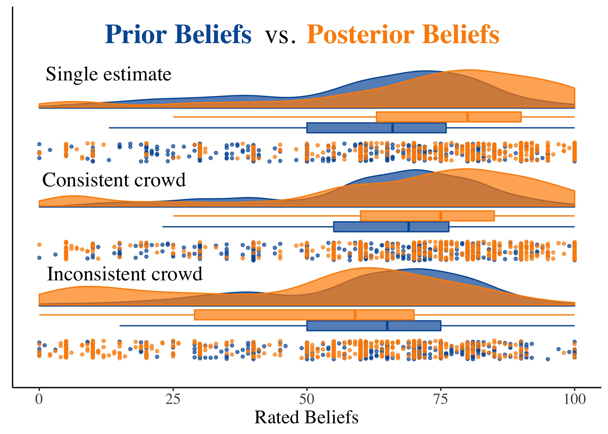

```{r setup, include=FALSE}
knitr::opts_chunk$set(echo = FALSE)
library(icons)
library(rsvg)
```

# Introduction

Every day, important scientific findings are rejected at large. From man-made climate change to the safety and efficacy of Covid-19 vaccinations, **science skepticism** has run rampant among lay consumers in modern society (Hornsey & Fielding, 2017). To **increase public faith in science**, some have proposed the use of **crowd science** (Silberzahn et al., 2018; Uhlmann et al., 2019).  
 $~~~~~$ We explore whether high consensus and low variance in parameter estimates among a **crowd** (the **consistent crowd** condition) can improve **lay perceptions of scientific findings**. In line with **social norm theory** (Miller & Prentice, 2016), we expect that **observing consensus among a crowd** will -- compared to the conclusion of a single scientist (the **single estimate** condition) -- increase conformity in opinion. Drawing from work on **intuitive statistics** (Gigerenzer & Murray, 2015), we also expect laypeople to intuitively follow the logic of the **wisdom of crowds**: the ability of an **aggregate of estimates** (rather than a single estimate) to **reduce noise** stemming from individual bias or error (Schweinsberg et al., 2021).  
  $~~~~~$ In contrast, when crowd estimates show low consensus and high variance (the **inconsistent crowd** condition), we predict that observers will be less swayed and more likely to **attribute** the findings to **bias** and **error**. In addition, due to the difficulty of lay reasoning about variation (Ben-Zvi & Garfield, 1999), we predict an **aversion to variability**: i.e., we expect that observing variable estimates will decrease lay **confidence** in the precise average parameter estimate in both crowd conditions.   
 
# Hypotheses
 **Table 1**: *Predicted differences with the single estimate condition*  

| Measure | Consistent crowd | Inconsistent crowd |
| ------------- |  ------------- | ------------- | 
| 1. Posterior beliefs in the phenomenon | $~~~~~~~~~~$ `r icon_style(icons::fontawesome("user-plus"), scale = 1.5, fill = "green")`  | $~~~~~~~~~~$ `r icon_style(icons::fontawesome("user-minus"), scale = 1.5, fill = "red")` |
|2. Credibility of the results | $~~~~~~~~~~$ `r icon_style(icons::fontawesome("user-plus"), scale = 1.5, fill = "green")` | $~~~~~~~~~~$ `r icon_style(icons::fontawesome("user-minus"), scale = 1.5, fill = "red")` |
| 3. Confidence in the precise estimate  | $~~~~~~~~~~$ `r icon_style(icons::fontawesome("user-minus"), scale = 1.5, fill = "red")`  | $~~~~~~~~~~$ `r icon_style(icons::fontawesome("user-minus"), scale = 1.5, fill = "red")` | 
| 4. Bias | $~~~~~~~~~~$ `r icon_style(icons::fontawesome("user-minus"), scale = 1.5, fill = "red")` | $~~~~~~~~~~$ `r icon_style(icons::fontawesome("user-plus"), scale = 1.5, fill = "green")` |
| 5. Error | $~~~~~~~~~~$ `r icon_style(icons::fontawesome("user-minus"), scale = 1.5, fill = "red")` | $~~~~~~~~~~$ `r icon_style(icons::fontawesome("user-plus"), scale = 1.5, fill = "green")` |
| 6. Discretion | $~~~$ No prediction | $~~~$ No prediction |  
*Note.* We regress each outcome on **prior beliefs** and **condition** (with the **single estimate condition** as the **reference category**). When laypeople observe multiple consistent (inconsistent) estimates from a crowd, we expect -- compared to a single estimate and controlling for prior beliefs -- higher (lower) **posterior beliefs** and **credibility** of the results, lower **confidence** in the precise average parameter estimate, and lower (higher) ratings of **bias** and **error**.  

**Open Science:** Preregistration, survey, data, and code available at        
`r icon_style(icons::fontawesome("github"), scale = 1.3, fill = "#035AA6")` $~~$ [Insert GitHub link here]   
`r icon_style(icons::academicons("osf"), scale = 1.3, fill = "#035AA6")` $~~$ [Insert OSF link here]

# Methods

We ran an experiment (*N* = 1,498; UK/US Prolific) with **three conditions**  
`r icon_style(icons::fontawesome("dice-one"), scale = 1.5, fill = "#035AA6")` $~$ **Single estimate**  
A single parameter estimate (5%)   
`r icon_style(icons::fontawesome("dice-two"), scale = 1.5, fill = "#035AA6")` $~$ **Consistent crowd**  
Multiple crowd estimates: low variance, high consensus (M = 5%)  
`r icon_style(icons::fontawesome("dice-three"), scale = 1.5, fill = "#035AA6")` $~$ **Inconsistent crowd**  
Multiple crowd estimates: high variance, low consensus (M = 5%) 

**Experimental Design**  

```{r, echo = FALSE, out.width='100%', fig.retina=3, fig.align='left'}
knitr::include_graphics("mermaid.png")
```

# Results

**Figure 1**: *Estimates of differences with the single estimate condition*
```{r, echo = FALSE, out.width='93%', fig.retina=3, fig.align='left'}
knitr::include_graphics("Figure1.jpg")
```
**In line with our hypotheses**, lay consumers of **inconsistent crowd estimates** (vs. a single estimate)...  
`r icon_style(icons::fontawesome("arrow-circle-down"), scale = 1.5, fill = "red")` $~~$ Have lower posterior beliefs about the reported phenomenon  
`r icon_style(icons::fontawesome("arrow-circle-down"), scale = 1.5, fill = "red")` $~~$ Find the results less credible  
`r icon_style(icons::fontawesome("arrow-circle-down"), scale = 1.5, fill = "red")` $~~$ Have less confidence in the average estimate of 5%  
`r icon_style(icons::fontawesome("arrow-circle-up"), scale = 1.5, fill = "green")` $~~$ Are more likely to attribute the average estimate (5%) to bias   
`r icon_style(icons::fontawesome("arrow-circle-up"), scale = 1.5, fill = "green")` $~~$ Are more likely to attribute the average estimate (5%) to error   

**Contrary to our hypotheses**, lay consumers of **consistent crowd estimates** (vs. a single estimate)...  
`r icon_style(icons::fontawesome("arrow-circle-down"), scale = 1.5, fill = "red")` $~~$ Have lower posterior beliefs about the reported phenomenon  
`r icon_style(icons::fontawesome("arrow-circle-up"), scale = 1.5, fill = "green")` $~~$ Are more likely to attribute the average estimate (5%) to error  

We found **no significant effects** for lay consumers of **consistent crowd estimates** (vs. a single estimate) on...  
`r icon_style(icons::fontawesome("question-circle"), scale = 1.5, fill = "grey")` $~~$ Credibility of the results  
`r icon_style(icons::fontawesome("question-circle"), scale = 1.5, fill = "grey")` $~~$ Confidence in the average estimate   
`r icon_style(icons::fontawesome("question-circle"), scale = 1.5, fill = "grey")` $~~$ Ratings of bias 

**Exploratory results**

For the additional **exploratory measure**, lay consumers of consistent and inconsistent **crowd estimates**...  
`r icon_style(icons::fontawesome("arrow-circle-up"), scale = 1.5, fill = "green")` $~~$ Perceive greater discretion (i.e., idiosyncratic choices)   

**Figure 2**: *Distribution of prior and posterior beliefs by condition*  
```{r, echo = FALSE, out.width='100%', fig.retina=3, fig.align='center'}

```

In terms of **belief updating**, Figure 2 shows a positive difference within the consistent crowd condition $($pre vs. post $M_d$ = 4.75 [2.55,6.95]$)$, but less so than for the single estimate condition $(M_d$ = 11.66 [9.66,13.66]$)$. As expected, we find negative belief updating in the inconsistent crowd condition $(M_d$ = -11.45 [-13.75,-9.16]$)$.

# Conclusion 
 $~~$ **Compared to providing a single estimate, we find no evidence that**   
 $~~~~~~~$ **crowd estimates improve lay perceptions of scientific findings**

**Future Directions**  
`r icon_style(icons::fontawesome("question-circle"), scale = 1.5, fill = "#035AA6")` $~~$ Does **variability aversion** explain the findings?  
`r icon_style(icons::fontawesome("flask"), scale = 1.5, fill = "#035AA6")` $~~~$ Perceptions of **scientists**  
`r icon_style(icons::fontawesome("comments"), scale = 1.5, fill = "#035AA6")` $~~$ **Science communication** and **communicating uncertainty**