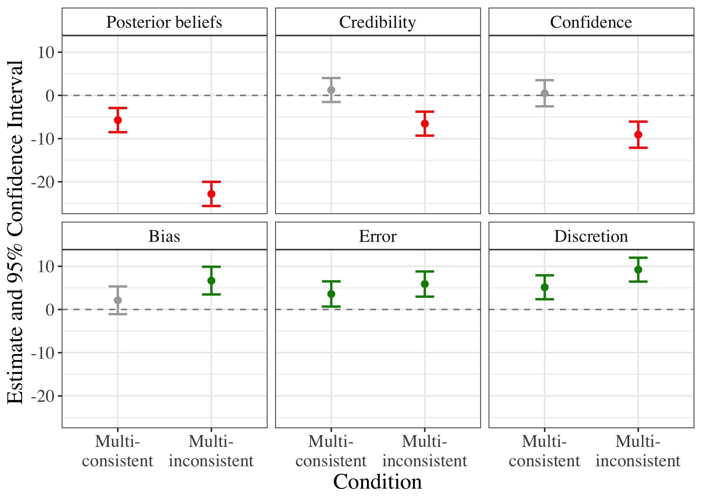

```{r setup, include=FALSE}
knitr::opts_chunk$set(echo = FALSE)
library(icons)
library(rsvg)
```

# Introduction

The **credibility of scientific research** is in doubt, among lay consumer (Hornsey & Fielding, 2017) and scientist (Pashler & Wagenmakers, 2021) alike. Several tools have been proposed to combat this "crisis of confidence" (Ibid., p. 528). One such tool is the **crowd science** approach: "the organization of scientific research in open and collaborative projects" (Franzoni & Sauermann, 2014, p. 1). We focus on **crowdsourced data analysis**, also known as the **many analysts** or **multi-analyst** approach: giving the same dataset to different teams of scientists, who independently analyze it to answer the same research question and/or estimate a parameter of interest.  
 $~~~~~$ According to science reformers, crowd-scientific findings that tell a consistent story should garner more confidence in the conclusions and **increase public faith in science** (Silberzahn et al., 2018; Uhlmann et al., 2019). Here, we ask if we can find empirical evidence for these claims: **Does crowdsourcing data analysis improve lay perceptions of scientific findings?**  

**Objectives**  

We explore **the effects of scientific findings emerging from a crowd of researchers** (vs. a typical research collaboration) **on lay consumers**' posterior beliefs, perceptions of credibility, confidence in an aggregate effect size estimate, and ratings of researcher bias, error, and discretion.  
 $~~~~~$ We compare the effects of providing lay consumers with a single, aggregate parameter estimate (the **single-analyst** condition) vs. multiple parameter estimates that (a) vary slightly and are all positive, leading to the same qualitative conclusion (the **multi-consistent** condition) or (b) vary widely and are of both signs, leading to differing qualitative conclusions (the **multi-inconsistent** condition). In all three conditions, the given estimates average to 5%.   

**Preregistered Hypotheses**  

**Table 1**: *Predicted direction of effects*  

| Measure | Multi-consistent | Multi-inconsistent |
| ------------- |  ------------- | ------------- | 
| 1. Posterior beliefs | $~~~~~~~~~~$ `r icon_style(icons::fontawesome("user-plus"), scale = 1.5, fill = "green")`  | $~~~~~~~~~~$ `r icon_style(icons::fontawesome("user-minus"), scale = 1.5, fill = "red")` |
|2. Credibility of the results | $~~~~~~~~~~$ `r icon_style(icons::fontawesome("user-plus"), scale = 1.5, fill = "green")` | $~~~~~~~~~~$ `r icon_style(icons::fontawesome("user-minus"), scale = 1.5, fill = "red")` |
| 3. Confidence in the precise estimate  | $~~~~~~~~~~$ `r icon_style(icons::fontawesome("user-minus"), scale = 1.5, fill = "red")`  | $~~~~~~~~~~$ `r icon_style(icons::fontawesome("user-minus"), scale = 1.5, fill = "red")` | 
| 4. Researcher bias | $~~~~~~~~~~$ `r icon_style(icons::fontawesome("user-minus"), scale = 1.5, fill = "red")` | $~~~~~~~~~~$ `r icon_style(icons::fontawesome("user-plus"), scale = 1.5, fill = "green")` |
| 5. Researcher error | $~~~~~~~~~~$ `r icon_style(icons::fontawesome("user-minus"), scale = 1.5, fill = "red")` | $~~~~~~~~~~$ `r icon_style(icons::fontawesome("user-plus"), scale = 1.5, fill = "green")` |
| 6. Researcher discretion | $~~~$ No prediction | $~~~$ No prediction |
*Note*. Table 1 indicates the predicted direction of effects for all outcomes, **compared to the single-analyst condition** and **controlling for prior beliefs** (a green plus/red minus indicates a positive/negative prediction, respectively). For example, we hypothesized that, compared to a single-analyst study and controlling for prior beliefs, ratings of credibility would be greater in the multi-consistent condition and lower in the multi-inconsistent condition.  


# Methods

We run an experiment (*N* = 1,498) with **three conditions**  
`r icon_style(icons::fontawesome("dice-one"), scale = 1.5, fill = "#035AA6")` $~$ **Single-analyst**  
A single, aggregate parameter estimate  
`r icon_style(icons::fontawesome("dice-two"), scale = 1.5, fill = "#035AA6")` $~$ **Multi-consistent**  
Multiple parameter estimates with low variance and high consensus  
`r icon_style(icons::fontawesome("dice-three"), scale = 1.5, fill = "#035AA6")` $~$ **Multi-inconsistent**  
Multiple parameter estimates with high variance and low consensus  

**Experimental Design**  

```{r, echo = FALSE, out.width='100%', fig.retina=3, fig.align='left'}
knitr::include_graphics("mermaid.png")
```

# Results

**Figure 1**: *Estimates relative to the single-analyst condition*
```{r, echo = FALSE, out.width='95%', fig.retina=3, fig.align='left'}

```
**In line with our hypotheses**, lay consumers of multi-analyst studies with **inconsistent** results  
`r icon_style(icons::fontawesome("arrow-circle-down"), scale = 1.5, fill = "red")` $~~~$ Have lower posterior beliefs  
`r icon_style(icons::fontawesome("arrow-circle-down"), scale = 1.5, fill = "red")` $~~~$ Find the results less credible  
`r icon_style(icons::fontawesome("arrow-circle-down"), scale = 1.5, fill = "red")` $~~~$ Have less confidence in the average effect size estimate  
`r icon_style(icons::fontawesome("arrow-circle-up"), scale = 1.5, fill = "green")` $~~~$ Believe the results are more likely to stem from bias  
`r icon_style(icons::fontawesome("arrow-circle-up"), scale = 1.5, fill = "green")` $~~~$ Believe the results are more likely to stem from error  

**Contrary to our hypotheses**, lay consumers of multi-analyst studies with **consistent** results  
`r icon_style(icons::fontawesome("arrow-circle-down"), scale = 1.5, fill = "red")` $~~~$ Have lower posterior beliefs  
`r icon_style(icons::fontawesome("arrow-circle-up"), scale = 1.5, fill = "green")` $~~~$ Believe the results are more likely to stem from error  

We found **no significant effects** on  
`r icon_style(icons::fontawesome("question-circle"), scale = 1.5, fill = "grey")` $~~~$ Credibility of the results  
`r icon_style(icons::fontawesome("question-circle"), scale = 1.5, fill = "grey")` $~~~$ Confidence in the effect size estimate  
`r icon_style(icons::fontawesome("question-circle"), scale = 1.5, fill = "grey")` $~~~$ Ratings of bias  

**Exploratory results**

For the additional **exploratory measure**, lay consumers of multi-analyst studies (both with **consistent** and **inconsistent** results)  
`r icon_style(icons::fontawesome("arrow-circle-up"), scale = 1.5, fill = "green")` $~~~$ Perceive greater researcher degrees of freedom  

**Figure 2**: *Distribution of prior and posterior beliefs by condition*  
```{r, echo = FALSE, out.width='90%', fig.retina=3, fig.align='center'}

```

# Discussion  
**Conclusion**  
`r icon_style(icons::fontawesome("sitemap"), scale = 1.3, fill = "#035AA6")` $~$ Crowdsourced data analysis has **many worthy uses**, but...    
`r icon_style(icons::fontawesome("hand-holding-usd"), scale = 1.3, fill = "#035AA6")` $~~$ It's highly **resource-intensive**    
`r icon_style(icons::fontawesome("exclamation-triangle"), scale = 1.3, fill = "#035AA6")` $~$ **Variability** and  **lack of consensus** may evoke negative responses
`r icon_style(icons::fontawesome("question-circle"), scale = 1.3, fill = "#035AA6")` $~~$ Surprisingly, even **multiple, consistent estimates may backfire**

**Future Directions**  
`r icon_style(icons::fontawesome("flask"), scale = 1.3, fill = "#035AA6")` $~~~$ Perceptions of **scientists**?  
`r icon_style(icons::fontawesome("comments"), scale = 1.3, fill = "#035AA6")` $~~$ **Science communication** and **communicating uncertainty**  

**Open Science Statement**  
The preregistration, survey materials, data, and code that support the findings of this study are openly available on GitHub and the OSF.  
`r icon_style(icons::fontawesome("github"), scale = 1.3, fill = "#035AA6")` $~~$ [Insert GitHub link here]   
`r icon_style(icons::academicons("osf"), scale = 1.3, fill = "#035AA6")` $~~$ [Insert OSF link here]  