```{r setup, include=FALSE}
options(htmltools.dir.version = FALSE)
knitr::opts_chunk$set(
  fig.width=9, fig.height=3.5, fig.retina=3,
  out.width = "100%",
  cache = FALSE,
  echo = TRUE,
  message = FALSE, 
  warning = FALSE,
  hiline = TRUE
)
```

```{r xaringan-themer, include=FALSE, warning=FALSE}
library(tidyverse)
library(xaringanthemer)
library(xaringanExtra)
library(icons)
library(widgetframe)
library(DiagrammeR)

style_duo(primary_color = "#ffffff", 
          secondary_color = "#035AA6")
```

```{r xaringan-tile-view, echo=FALSE}
xaringanExtra::use_tile_view()
```

```{r xaringan-panelset, echo=FALSE}
xaringanExtra::use_panelset()
```

```{r echo=FALSE}
xaringanExtra::style_panelset_tabs(
  active_foreground = "#035AA6",
  hover_foreground = "#d22"
 )
```

```{r xaringanExtra, echo = FALSE}
xaringanExtra::use_progress_bar(color = "#035AA6", location = "top")
```

```{r, echo = FALSE}
set.seed(1808)

estimates <- data.frame(
  Estimate = sample(
    x = c(seq(-0.3, 0.3, .001), seq(-0.1, 0.1, .0001)), 
    size = 100
    ),
  se = sample(
    x = seq(0.003, 0.04, .001),
    replace = TRUE,
    size = 100
  )) %>% 
  arrange(Estimate) %>% 
  mutate(Team = 1:100,
         Conclusion = case_when(
           Estimate - 1.96 * se < 0 & Estimate + 1.96 * se < 0 ~ "Negative Evidence",
           Estimate - 1.96 * se < 0 & Estimate + 1.96 * se > 0 ~ "Inconclusive Evidence",
           Estimate - 1.96 * se > 0 & Estimate + 1.96 * se > 0 ~ "Positive Evidence"
         )) %>% 
  mutate(Conclusion = factor(Conclusion,
                             levels = c("Negative Evidence",
                                        "Inconclusive Evidence",
                                        "Positive Evidence")))

title_plot <- ggplot(data = estimates, 
                     mapping = aes(x = Team, y = Estimate, color = Conclusion)) +
  geom_point(size = 2) +
  geom_errorbar(mapping = aes(ymin = Estimate - 1.96 * se, 
                              ymax = Estimate + 1.96 * se),
                width = 3) + 
  theme_classic() +
  geom_hline(yintercept = 0, linetype = "dashed", color = "grey") +
  labs(x = "Science Team", 
       y = "Obtained Effect Size",
       color = "Conclusion of Science Team") +
  scale_color_discrete(type = c("red", "orange", "green4")) +
  theme(legend.position = c(0.35, 0.8),
        text = element_text(size = 19))

ggsave("title_plot.jpg", title_plot, 
       width = 7, height = 5, units = "in")
```

# Lay Perceptions of Crowd-Scientific Findings

**The Risks of Variability and Lack of Consensus**  
[Shilaan Alzahawi](http://shilaan.rbind.io) & [Benoît Monin](https://www.gsb.stanford.edu/faculty-research/faculty/benoit-monin)

.pull-left[
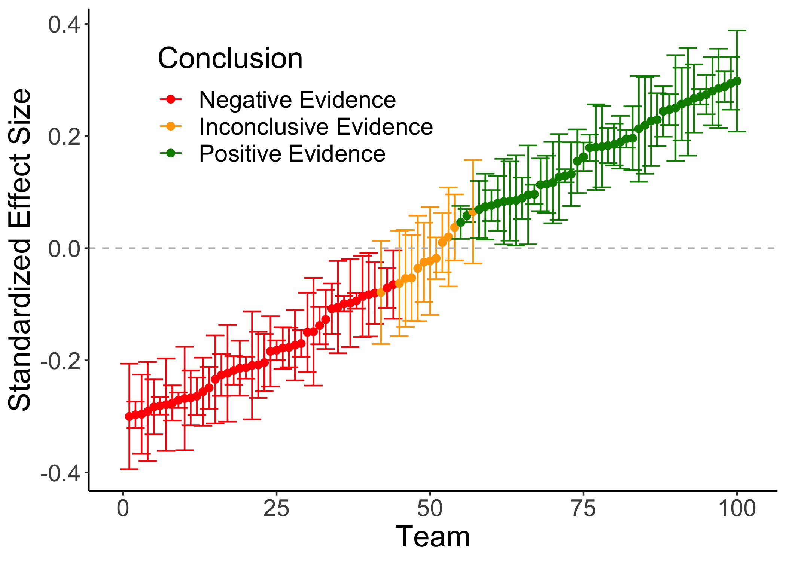
]

.pull-right[
$~~$  


[`r icon_style(icons::fontawesome("twitter"), scale = 2, fill = "#035AA6")` $~~$ twitter.com/shilaan01](https://twitter.com/shilaan01)    
[`r icon_style(icons::fontawesome("globe"), scale = 2, fill = "#035AA6")` $~~$ shilaan.rbind.io](https://shilaan.rbind.io)     
[`r icon_style(icons::fontawesome("github"), scale = 2, fill = "#035AA6")` $~~$ github.com/shilaan](https://github.com/shilaan)  
[`r icon_style(icons::fontawesome("paper-plane"), scale = 2, fill = "#035AA6")` $~~$ shilaan@stanford.edu](mailto:shilaan@stanford.edu)

]
---
# Outline 

--
`r icon_style(icons::fontawesome("lock-open"), scale = 2, fill = "#035AA6")` $~~$ [**Open Science Statement**](#openscience)   
--

`r icon_style(icons::fontawesome("users"), scale = 2, fill = "#035AA6")` $~$ [**Crowdsourcing Science**](#crowdscience)  
--

`r icon_style(icons::fontawesome("chart-bar"), scale = 2, fill = "#035AA6")` $~~~$ [**Crowdsourcing Data Analysis**](#crowddata)  
--

`r icon_style(icons::fontawesome("question-circle"), scale = 2, fill = "#035AA6")` $~~~$ [**Lay Perceptions: Are Crowd-Scientific Findings More Credible?**](#lay)   
--

`r icon_style(icons::fontawesome("tools"), scale = 2, fill = "#035AA6")` $~~~$ [**Method**](#method)  
--

`r icon_style(icons::fontawesome("chart-line"), scale = 2, fill = "#035AA6")` $~~~$ [**Results**](#results)  
--

`r icon_style(icons::fontawesome("comment"), scale = 2, fill = "#035AA6")` $~~~$ [**Discussion**](#discussion)

---
class: inverse, middle, center
name: openscience

# Open Science Statement

---
background-image: url("https://github.com/allisonhorst/stats-illustrations/raw/master/rstats-artwork/reproducibility_court.png")
background-position: 90% 50%
background-size: 50%

# Open Science Statement

--
[`r icon_style(icons::academicons("preregistered"), scale = 2, fill = "#035AA6")` $~~$ Preregistration](https://osf.io/rpu98)  

--

[`r icon_style(icons::academicons("open-materials"), scale = 2, fill = "#035AA6")` $~~$ Open materials](https://osf.io/6vze3)  

--

[`r icon_style(icons::academicons("open-data"), scale = 2, fill = "#035AA6")` $~~$ Open data](https://osf.io/b527v/)  

--

[`r icon_style(icons::fontawesome("r-project"), scale = 2, fill = "#035AA6")` $~$ Reproducible manuscript](https://github.com/shilaan/Many-Analysts/tree/main/manuscript)    

--

[`r icon_style(icons::academicons("osf"), scale = 2, fill = "#035AA6")` $~~$ osf.io/vedb4](https://osf.io/vedb4)    

--

[`r icon_style(icons::fontawesome("github"), scale = 2, fill = "#035AA6")` $~~$ github.com/shilaan/many-analysts](https://github.com/shilaan/many-analysts)    

.right[
Artwork by [@allison_horst](https://github.com/allisonhorst/stats-illustrations)
]

---
class: inverse, center, middle
name: crowdscience

# Crowdsourcing Science

---
.center[
# Crowd Science
]

--

### The organization of scientific research in open and collaborative projects

--

From highly **inclusive** (sourcing citizens) to highly **selective** (sourcing specialists)    

--

Used at different **stages** of the research process  

--


.pull-left[

.pull-left[

`r icon_style(icons::fontawesome("coins"), scale = 1, fill = "#035AA6")` $~~~$ **Funding**
`r icon_style(icons::fontawesome("lightbulb"), scale = 1, fill = "#035AA6")`  $~~~~$ **Ideation**
`r icon_style(icons::fontawesome("project-diagram"), scale = 1, fill = "#035AA6")`  $~~$  **Study design**
`r icon_style(icons::fontawesome("folder-open"), scale = 1, fill = "#035AA6")`  $~~$  **Data collection**

]


.pull-right[

`r icon_style(icons::fontawesome("laptop-code"), scale = 1, fill = "#035AA6")`  $~~$   **Data analysis**
`r icon_style(icons::fontawesome("feather-alt"), scale = 1, fill = "#035AA6")`  $~~~$    **Writing**
`r icon_style(icons::fontawesome("file-pdf"), scale = 1, fill = "#035AA6")`  $~~~$    **Peer review**
`r icon_style(icons::fontawesome("check-double"), scale = 1, fill = "#035AA6")`  $~~$   **Replication**

]

]

.pull-right[


]

---
background-image: url("images/meteor.jpeg")
background-position: 90% 73%
background-size: 42%

.center[
# Crowd Science
]

### The organization of scientific research in open and collaborative projects


From highly **inclusive** (sourcing citizens) to highly **selective** (sourcing specialists)    


Used at different **stages** of the research process  


.pull-left[

.pull-left[

`r icon_style(icons::fontawesome("coins"), scale = 1, fill = "#035AA6")` $~~~$ **Funding**
`r icon_style(icons::fontawesome("lightbulb"), scale = 1, fill = "#035AA6")`  $~~~~$ **Ideation**
`r icon_style(icons::fontawesome("project-diagram"), scale = 1, fill = "#035AA6")`  $~~$  **Study design**
`r icon_style(icons::fontawesome("folder-open"), scale = 1, fill = "#035AA6")`  $~~$  **Data collection**

]

.pull-right[

`r icon_style(icons::fontawesome("laptop-code"), scale = 1, fill = "#035AA6")`  $~~$   **Data analysis**
`r icon_style(icons::fontawesome("feather-alt"), scale = 1, fill = "#035AA6")`  $~~~$    **Writing**
`r icon_style(icons::fontawesome("file-pdf"), scale = 1, fill = "#035AA6")`  $~~~$    **Peer review**
`r icon_style(icons::fontawesome("check-double"), scale = 1, fill = "#035AA6")`  $~~$   **Replication**

]

]

.pull-right[


]

.right[

$~~$  
$~~$  
The great meteor storm of 1833: birth of *Citizen Science*

]

???

In 1833, Denison Olmsted used letter correspondence to recruit citizen scientists to help document a meteor shower. This led to a detailed documentation of the great meteor shower and the birth of the citizen-science movement (highly inclusive, used for data collection.
---
class: inverse, center, middle
name: crowddata

# Crowdsourcing Data Analysis


---
.center[
# Crowdsourced Data Analysis 


]

--

### Different teams of scientists independently analyze the same dataset

--

`r icon_style(icons::fontawesome("users"), scale = 2, fill = "#035AA6")` $~~$ Also known as the **many-analysts** or **multi-analyst** approach

--

`r icon_style(icons::fontawesome("chart-line"), scale = 2, fill = "#035AA6")` $~~~~$ On the **rise** in the social and behavioral sciences

--

```{r, echo = FALSE}
t1 <- data.frame(
  Author = c(
    "Bastiaansen et al.",
    "Botvinik-Nezer et al.",
    "Breznau et al.",
    "Breznau et al.",
    "Huntington-Klein et al.",
    "Schweinsberg et al.",
    "Silberzahn et al."
  ),
  Year = c(
    2019,
    2020,
    2021,
    2021,
    2020,
    2018,
    2018
  ),
  Title = c(
    "Time to get personal? The impact of researchers choices on the selection of
treatment targets using the experience sampling methodology",
    
    "Variability in the analysis of a single neuroimaging dataset by many teams",

    "How many replicators does it take to achieve reliability? Investigating researcher variability in a crowdsourced replication",

    "Observing many researchers using the same data and hypothesis
reveals a hidden universe of uncertainty",

    "The influence of hidden researcher decisions in applied microeconomics",
    
    "Same data, different conclusions: Radical dispersion in empirical results when independent analysts operationalize and test the same hypothesis",
    
    "Many analysts, one data set: Making transparent how variations in analytic choices affect results"
  ) 
) %>% 
  arrange(desc(Year))

DT::datatable(t1, fillContainer = FALSE, options = list(pageLength = 2))
```

---
class: inverse, center, middle
name: lay

# Lay Perceptions


---
# Credibility of Crowd-Scientific Findings

According to science reformers, crowd-scientific findings should **increase the credibility of scientific research**
--

$~~$  

```{r, echo = FALSE}
t2 <- data.frame(
  Author = c(
    "Aczel et al.",
    "Arbon et al.",
    "Auspurg & Brüderl",
    "Breznau et al.",
    "Breznau",
    "Silberzahn & Uhlmann",
    "Silberzahn et al.",
    "Uhlmann et al."
  ),
  
  Year = c(
    2021,
    2019,
    2021,
    2021,
    2021,
    2015,
    2018,
    2019
  ),
  Quote = c(
    "When the results of independent data analyses converge, <b>more confidence in the conclusions</b> is warranted. When the results diverge, confidence appropriately falters, and scientists can examine the reasons for these discrepancies.",
    
    "<b>For the public to have faith in the conclusions of scientists</b> it is important that the methods they employ are robust and transparent. This study will examine robustness by recruiting teams of independent data analysts and looking at how they answer a controversial research question using the same data, effectively ‘crowd-sourcing’ the data analysis.",
    
    "Several researchers analyze the same research question with the same data (…) <b>Science is credible</b> if different researchers come up with a similar answer",
    
    "Organized scientific knowledge production (…) should generate inter-researcher reliability, <b>offering consumers of scientific findings assurance</b> that they are not arbitrary flukes but that other researchers would generate similar findings given the same data.",
    
    "crowdsourcing provides a new way to <b>increase credibility</b> for political and social research—in both sample populations and among the researchers themselves (…) It is hoped that these developments are tangible outcomes that <b>increase public, private, and government views of social science</b>.",
    
    "the results are <b>more credible</b> (…) <b>greater certainty</b> comes from having an independent check.",
    
    "Scientists can have comparatively <b>more faith</b> in a finding when there is less variability in analytic approaches taken to investigating the targeted phenomenon and in results obtained using different methods. (…) In such extreme cases of little to no convergence in results, the crowdsourcing process suggests that the scientific community should have <b>no faith</b> that the hypothesis is true",
    
    "crowdsourced teams can conduct high-powered, precise studies and draw <b>confident conclusions</b>. (…) Crowdsourcing research is a part of a changing landscape of science that seeks to <b>improve research reliability</b> and <b>advance the credibility</b> of academic research"
    
  )
) %>% 
  arrange(desc(Year))

DT::datatable(t2, 
              fillContainer = FALSE, 
              options = list(pageLength = 2),
              escape = FALSE)
```

???

Normatively, we expect laypeople who observe several scientists independently come to the same qualitative conclusions – compared to a single research team that comes to a single, joint conclusion – to be more swayed by the findings, as it seems to reflect consensus between various approaches. After all, it’s a hallmark of rigorous research to triangulate various methodological approaches and provide converging evidence, and to provide a “sensitivity analysis” or “robustness checks” to examine whether and how the findings change as a result of alternative analytic specifications. As argued in Aczel et al., “The main argument for the importance of performing robustness checks over reasonable variations in modelling choices is to increase confidence in the obtained results: ideally, results should be reasonably unaffected by a researcher’s idiosyncratic choice (…) when reasonable alternatives exist.” The same argument has been made for triangulation, which, according to Jick, “allows researchers to be more confident of their results.”
We similarly expect readers of multi-analyst reports that yield consistent findings to be more confident in the results. Although lay observers, in such cases, may be less certain that the precise aggregate parameter estimate is exactly correct, they should be more likely to positively update their beliefs about the reported phenomenon, and less likely to assume that the overall estimate stems from bias or error. Thus, when the results generated by independent analysts are largely consistent, we expect an increase in the sway of scientific findings. However, when laypeople observe several scientists independently come to differing qualitative conclusions, we expect the multi-analyst method to backfire; when results across many analysts vary widely and lack consensus in their qualitative conclusions (which, arguably, often reflects the reality of large-scale science collaborations), we expect a decrease in the sway of scientific findings.

---
class: inverse, center, middle
name: method

# Method

---

## Are Crowd-Scientific Findings More Credible `r icon_style(icons::fontawesome("question-circle"), scale = 1, fill = "#035AA6")`

--

We run an experiment with **three conditions**
--

`r icon_style(icons::fontawesome("dice-one"), scale = 1.5, fill = "#035AA6")` $~~$ **Single-analyst** $~~~~~~~~~~~$ a *single, aggregate parameter estimate*

--

`r icon_style(icons::fontawesome("dice-two"), scale = 1.5, fill = "#035AA6")` $~~$ **Multi-consistent** $~~~~~~~$ *multiple parameter estimates* with *low variance* and *high consensus* 

--

`r icon_style(icons::fontawesome("dice-three"), scale = 1.5, fill = "#035AA6")` $~~$ **Multi-inconsistent** $~~~~$ *multiple parameter estimates* with *high variance* and *low consensus* 

--

$~~$  
and study the **effects on** 

.pull-left[
`r icon_style(icons::fontawesome("angle-right"), scale = 1.5, fill = "#035AA6")` Posterior beliefs  
`r icon_style(icons::fontawesome("angle-right"), scale = 1.5, fill = "#035AA6")` Perceptions of credibility  
`r icon_style(icons::fontawesome("angle-right"), scale = 1.5, fill = "#035AA6")` Confidence in the aggregate effect size estimate  
]
.pull-right[
`r icon_style(icons::fontawesome("angle-right"), scale = 1.5, fill = "#035AA6")` Ratings of bias  
`r icon_style(icons::fontawesome("angle-right"), scale = 1.5, fill = "#035AA6")` Ratings of error  
`r icon_style(icons::fontawesome("angle-right"), scale = 1.5, fill = "#035AA6")` Ratings of discretion  
]

???

In all three conditions the estimates average to 5%

---
class: left

# Experimental design

--

```{r, echo=FALSE, fig.align='center', out.width='95%', fig.retina=3}
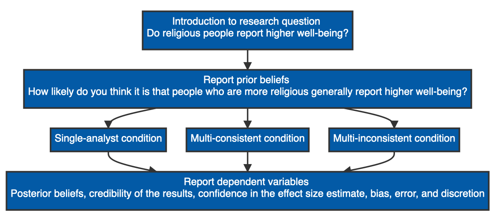
```

---

.center[

# Hypotheses

]


$~~$  

.pull-left[


`r icon_style(icons::fontawesome("compass"), scale = 1.5, fill = "#035AA6")` $~~~~$**Predicted direction of effects**

`r icon_style(icons::fontawesome("users-slash"), scale = 1.5, fill = "#035AA6")` $~~~$**Compared to the single-analyst condition**  

`r icon_style(icons::fontawesome("history"), scale = 1.5, fill = "#035AA6")` $~~~~$**Controlling for prior beliefs**

`r icon_style(icons::academicons("preregistered"), scale = 1.5, fill = "#035AA6")` $~~~$ [**Preregistration at osf.io/rpu98**](https://osf.io/rpu98)  

]

.pull-right[

| Measure | Multi-consistent | Multi-inconsistent |
| ------------- |  ------------- | ------------- | 
| Posterior beliefs | .center[`r icon_style(icons::fontawesome("user-plus"), scale = 1.5, fill = "green")`]  | .center[`r icon_style(icons::fontawesome("user-minus"), scale = 1.5, fill = "red")`] |
]

???

*Note*. Table indicates the predicted direction of the effect for all dependent variables, compared to the single-analyst condition and controlling for prior beliefs. For example, we hypothesized that, compared to a single-analyst study and controlling for prior beliefs,  ratings of credibility would be greater in the multi-analyst: consistent condition and lower in the multi-analyst: inconsistent condition.  

Normatively, we expect laypeople who observe several scientists independently come to the same qualitative conclusions – compared to a single research team that comes to a single, joint conclusion – to be more swayed by the findings, as it seems to reflect consensus between various approaches. After all, it’s a hallmark of rigorous research to triangulate various methodological approaches and provide converging evidence, and to provide a “sensitivity analysis” or “robustness checks” to examine whether and how the findings change as a result of alternative analytic specifications. As argued in Aczel et al., “The main argument for the importance of performing robustness checks over reasonable variations in modelling choices is to increase confidence in the obtained results: ideally, results should be reasonably unaffected by a researcher’s idiosyncratic choice (…) when reasonable alternatives exist.” The same argument has been made for triangulation, which, according to Jick, “allows researchers to be more confident of their results.”
We similarly expect readers of multi-analyst reports that yield consistent findings to be more confident in the results. Although lay observers, in such cases, may be less certain that the precise aggregate parameter estimate is exactly correct, they should be more likely to positively update their beliefs about the reported phenomenon, and less likely to assume that the overall estimate stems from bias or error. Thus, when the results generated by independent analysts are largely consistent, we expect an increase in the sway of scientific findings. However, when laypeople observe several scientists independently come to differing qualitative conclusions, we expect the multi-analyst method to backfire; when results across many analysts vary widely and lack consensus in their qualitative conclusions (which, arguably, often reflects the reality of large-scale science collaborations), we expect a decrease in the sway of scientific findings.

---
.center[

# Hypotheses

]


$~~$  

.pull-left[

`r icon_style(icons::fontawesome("compass"), scale = 1.5, fill = "#035AA6")` $~~~~$**Predicted direction of effects**

`r icon_style(icons::fontawesome("users-slash"), scale = 1.5, fill = "#035AA6")` $~~~$**Compared to the single-analyst condition**  

`r icon_style(icons::fontawesome("history"), scale = 1.5, fill = "#035AA6")` $~~~~$**Controlling for prior beliefs**

`r icon_style(icons::academicons("preregistered"), scale = 1.5, fill = "#035AA6")` $~~~$ [**Preregistration at osf.io/rpu98**](https://osf.io/rpu98)  

]

.pull-right[

| Measure | Multi-consistent | Multi-inconsistent |
| ------------- |  ------------- | ------------- | 
| Posterior beliefs | .center[`r icon_style(icons::fontawesome("user-plus"), scale = 1.5, fill = "green")`]  | .center[`r icon_style(icons::fontawesome("user-minus"), scale = 1.5, fill = "red")`] |
|Credibility | .center[`r icon_style(icons::fontawesome("user-plus"), scale = 1.5, fill = "green")`] | .center[`r icon_style(icons::fontawesome("user-minus"), scale = 1.5, fill = "red")`] |
]

???

*Note*. Table indicates the predicted direction of the effect for all dependent variables, compared to the single-analyst condition and controlling for prior beliefs. For example, we hypothesized that, compared to a single-analyst study and controlling for prior beliefs,  ratings of credibility would be greater in the multi-analyst: consistent condition and lower in the multi-analyst: inconsistent condition.  

Our pre-registered hypotheses can be found in the table: we hypothesized that in the multi-consistent condition (compared to the single-analyst condition), lay consumers would have higher posterior beliefs, would find the results more credible, and would be less likely to believe the results stem from bias or error. For the multi-inconsistent condition, we hypothesized that lay consumers would have lower posterior beliefs, would find the results less credible, and would be more likely to believe the results stem from bias or error. In addition, we expected that the act of providing multiple (slightly to widely varying) parameter estimates would decrease confidence in the aggregate parameter estimate in both multi-analyst conditions.

---
.center[

# Hypotheses

]


$~~$  

.pull-left[

`r icon_style(icons::fontawesome("compass"), scale = 1.5, fill = "#035AA6")` $~~~~$**Predicted direction of effects**

`r icon_style(icons::fontawesome("users-slash"), scale = 1.5, fill = "#035AA6")` $~~~$**Compared to the single-analyst condition**  

`r icon_style(icons::fontawesome("history"), scale = 1.5, fill = "#035AA6")` $~~~~$**Controlling for prior beliefs**

`r icon_style(icons::academicons("preregistered"), scale = 1.5, fill = "#035AA6")` $~~~$ [**Preregistration at osf.io/rpu98**](https://osf.io/rpu98)  

]

.pull-right[

| Measure | Multi-consistent | Multi-inconsistent |
| ------------- |  ------------- | ------------- | 
| Posterior beliefs | .center[`r icon_style(icons::fontawesome("user-plus"), scale = 1.5, fill = "green")`]  | .center[`r icon_style(icons::fontawesome("user-minus"), scale = 1.5, fill = "red")`] |
|Credibility | .center[`r icon_style(icons::fontawesome("user-plus"), scale = 1.5, fill = "green")`] | .center[`r icon_style(icons::fontawesome("user-minus"), scale = 1.5, fill = "red")`] |
| Confidence  | .center[`r icon_style(icons::fontawesome("user-minus"), scale = 1.5, fill = "red")`]  | .center[`r icon_style(icons::fontawesome("user-minus"), scale = 1.5, fill = "red")`] | 
]

???

*Note*. Table indicates the predicted direction of the effect for all dependent variables, compared to the single-analyst condition and controlling for prior beliefs. For example, we hypothesized that, compared to a single-analyst study and controlling for prior beliefs,  ratings of credibility would be greater in the multi-analyst: consistent condition and lower in the multi-analyst: inconsistent condition.  

---
.center[

# Hypotheses

]


$~~$  

.pull-left[

`r icon_style(icons::fontawesome("compass"), scale = 1.5, fill = "#035AA6")` $~~~~$**Predicted direction of effects**

`r icon_style(icons::fontawesome("users-slash"), scale = 1.5, fill = "#035AA6")` $~~~$**Compared to the single-analyst condition**  

`r icon_style(icons::fontawesome("history"), scale = 1.5, fill = "#035AA6")` $~~~~$**Controlling for prior beliefs**

`r icon_style(icons::academicons("preregistered"), scale = 1.5, fill = "#035AA6")` $~~~$ [**Preregistration at osf.io/rpu98**](https://osf.io/rpu98)  

]

.pull-right[

| Measure | Multi-consistent | Multi-inconsistent |
| ------------- |  ------------- | ------------- | 
| Posterior beliefs | .center[`r icon_style(icons::fontawesome("user-plus"), scale = 1.5, fill = "green")`]  | .center[`r icon_style(icons::fontawesome("user-minus"), scale = 1.5, fill = "red")`] |
|Credibility | .center[`r icon_style(icons::fontawesome("user-plus"), scale = 1.5, fill = "green")`] | .center[`r icon_style(icons::fontawesome("user-minus"), scale = 1.5, fill = "red")`] |
| Confidence  | .center[`r icon_style(icons::fontawesome("user-minus"), scale = 1.5, fill = "red")`]  | .center[`r icon_style(icons::fontawesome("user-minus"), scale = 1.5, fill = "red")`] | 
| Bias | .center[`r icon_style(icons::fontawesome("user-minus"), scale = 1.5, fill = "red")`] | .center[`r icon_style(icons::fontawesome("user-plus"), scale = 1.5, fill = "green")`] |
]

???

*Note*. Table indicates the predicted direction of the effect for all dependent variables, compared to the single-analyst condition and controlling for prior beliefs. For example, we hypothesized that, compared to a single-analyst study and controlling for prior beliefs,  ratings of credibility would be greater in the multi-analyst: consistent condition and lower in the multi-analyst: inconsistent condition.  

---
.center[

# Hypotheses

]


$~~$  

.pull-left[

`r icon_style(icons::fontawesome("compass"), scale = 1.5, fill = "#035AA6")` $~~~~$**Predicted direction of effects**

`r icon_style(icons::fontawesome("users-slash"), scale = 1.5, fill = "#035AA6")` $~~~$**Compared to the single-analyst condition**  

`r icon_style(icons::fontawesome("history"), scale = 1.5, fill = "#035AA6")` $~~~~$**Controlling for prior beliefs**

`r icon_style(icons::academicons("preregistered"), scale = 1.5, fill = "#035AA6")` $~~~$ [**Preregistration at osf.io/rpu98**](https://osf.io/rpu98)  

]

.pull-right[

| Measure | Multi-consistent | Multi-inconsistent |
| ------------- |  ------------- | ------------- | 
| Posterior beliefs | .center[`r icon_style(icons::fontawesome("user-plus"), scale = 1.5, fill = "green")`]  | .center[`r icon_style(icons::fontawesome("user-minus"), scale = 1.5, fill = "red")`] |
|Credibility | .center[`r icon_style(icons::fontawesome("user-plus"), scale = 1.5, fill = "green")`] | .center[`r icon_style(icons::fontawesome("user-minus"), scale = 1.5, fill = "red")`] |
| Confidence  | .center[`r icon_style(icons::fontawesome("user-minus"), scale = 1.5, fill = "red")`]  | .center[`r icon_style(icons::fontawesome("user-minus"), scale = 1.5, fill = "red")`] | 
| Bias | .center[`r icon_style(icons::fontawesome("user-minus"), scale = 1.5, fill = "red")`] | .center[`r icon_style(icons::fontawesome("user-plus"), scale = 1.5, fill = "green")`] |
| Error | .center[`r icon_style(icons::fontawesome("user-minus"), scale = 1.5, fill = "red")`] | .center[`r icon_style(icons::fontawesome("user-plus"), scale = 1.5, fill = "green")`] |
]

???

*Note*. Table indicates the predicted direction of the effect for all dependent variables, compared to the single-analyst condition and controlling for prior beliefs. For example, we hypothesized that, compared to a single-analyst study and controlling for prior beliefs,  ratings of credibility would be greater in the multi-analyst: consistent condition and lower in the multi-analyst: inconsistent condition.  

---
.center[

# Hypotheses

]


$~~$  

.pull-left[

`r icon_style(icons::fontawesome("compass"), scale = 1.5, fill = "#035AA6")` $~~~~$**Predicted direction of effects**

`r icon_style(icons::fontawesome("users-slash"), scale = 1.5, fill = "#035AA6")` $~~~$**Compared to the single-analyst condition**  

`r icon_style(icons::fontawesome("history"), scale = 1.5, fill = "#035AA6")` $~~~~$**Controlling for prior beliefs**

`r icon_style(icons::academicons("preregistered"), scale = 1.5, fill = "#035AA6")` $~~~$ [**Preregistration at osf.io/rpu98**](https://osf.io/rpu98)  

]

.pull-right[

| Measure | Multi-consistent | Multi-inconsistent |
| ------------- |  ------------- | ------------- | 
| Posterior beliefs | .center[`r icon_style(icons::fontawesome("user-plus"), scale = 1.5, fill = "green")`]  | .center[`r icon_style(icons::fontawesome("user-minus"), scale = 1.5, fill = "red")`] |
|Credibility | .center[`r icon_style(icons::fontawesome("user-plus"), scale = 1.5, fill = "green")`] | .center[`r icon_style(icons::fontawesome("user-minus"), scale = 1.5, fill = "red")`] |
| Confidence  | .center[`r icon_style(icons::fontawesome("user-minus"), scale = 1.5, fill = "red")`]  | .center[`r icon_style(icons::fontawesome("user-minus"), scale = 1.5, fill = "red")`] | 
| Bias | .center[`r icon_style(icons::fontawesome("user-minus"), scale = 1.5, fill = "red")`] | .center[`r icon_style(icons::fontawesome("user-plus"), scale = 1.5, fill = "green")`] |
| Error | .center[`r icon_style(icons::fontawesome("user-minus"), scale = 1.5, fill = "red")`] | .center[`r icon_style(icons::fontawesome("user-plus"), scale = 1.5, fill = "green")`] |
| Discretion | .center[No prediction] | .center[No prediction] |
]

???

*Note*. Table indicates the predicted direction of the effect for all dependent variables, compared to the single-analyst condition and controlling for prior beliefs. For example, we hypothesized that, compared to a single-analyst study and controlling for prior beliefs,  ratings of credibility would be greater in the multi-analyst: consistent condition and lower in the multi-analyst: inconsistent condition.  


---
class: inverse, center, middle

# Survey Materials

---

.panelset.sideways[
.panel[.panel-name[Introduction]
```{r, echo = FALSE, out.width='90%'}
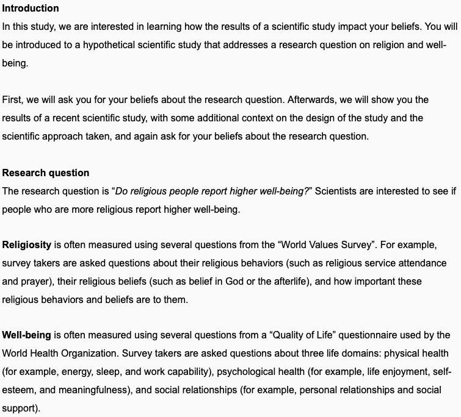
```
]
.panel[.panel-name[Prior Beliefs]

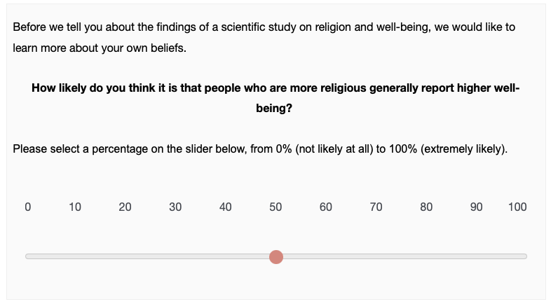
]

.panel[.panel-name[Thanks!]

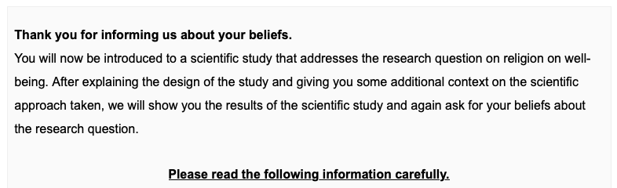
]
]

???

Participants had to wait 30 seconds before proceeding to the next slide. 
---
.panelset.sideways[
.panel[.panel-name[Study design & research approach (Single-analyst)]
```{r, echo = FALSE, out.width='93%'}
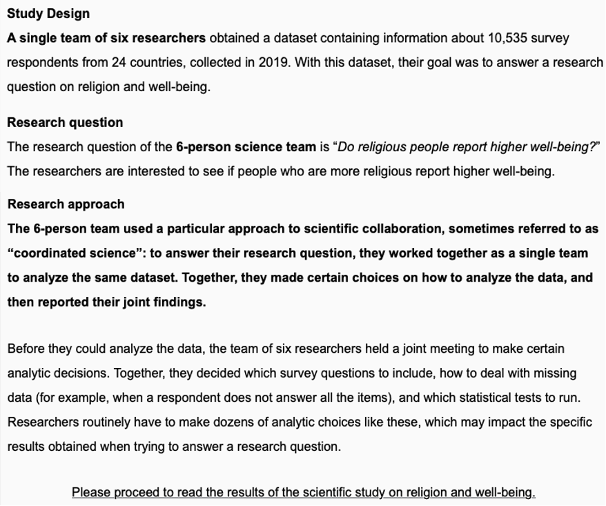
```
]

.panel[.panel-name[Study design & research approach (Multi-analyst)]
```{r, echo = FALSE, out.width='91%'}
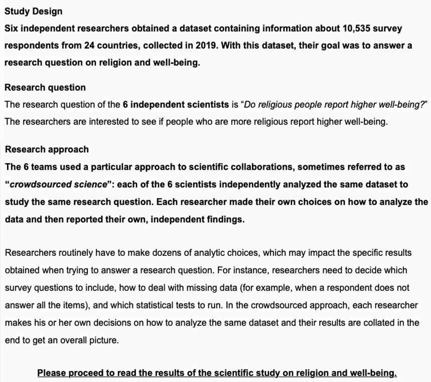
```
]
]

---

.panelset[
.panel[.panel-name[Results (Single-analyst)]
```{r, echo = FALSE, out.width='80%'}
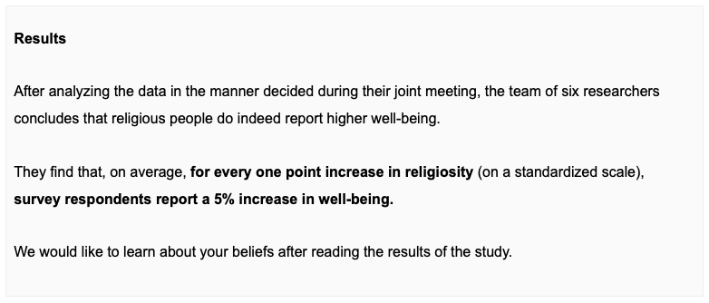
```
]

.panel[.panel-name[Results (Multi-consistent)]
```{r, echo = FALSE, out.width='80%'}
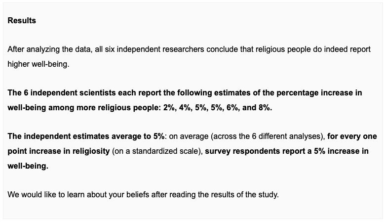
```
]

.panel[.panel-name[Results (Multi-inconsistent)]
```{r, echo = FALSE, out.width='80%'}
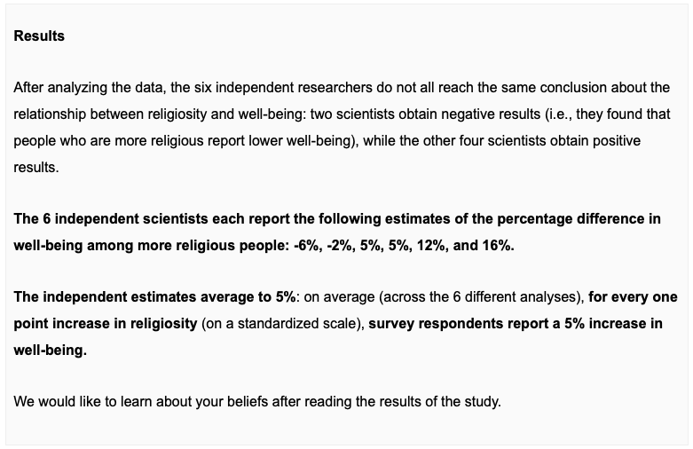
```
]
]

---

.panelset.sideways[
.panel[.panel-name[Posterior beliefs]
```{r, echo = FALSE, out.width='100%'}
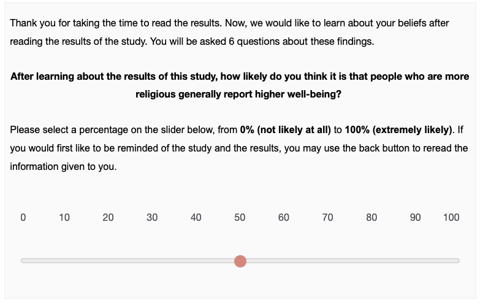
```
]

.panel[.panel-name[Credibility]
```{r, echo = FALSE, out.width='100%'}
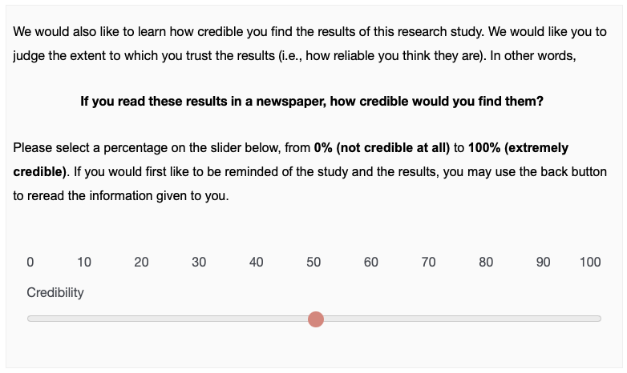
```
]

.panel[.panel-name[Confidence]
```{r, echo = FALSE, out.width='100%'}
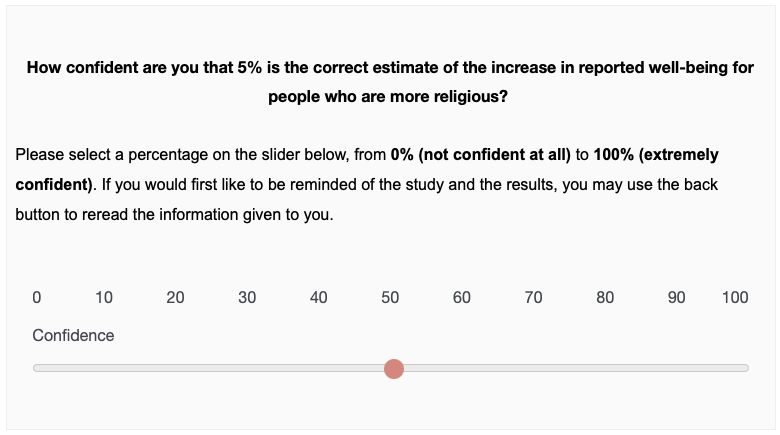
```
]

.panel[.panel-name[Bias]
```{r, echo = FALSE, out.width='100%'}
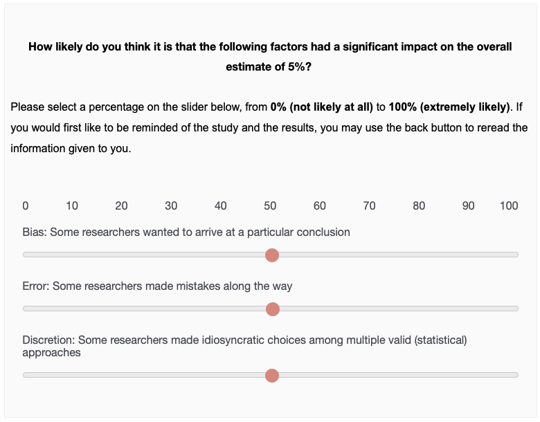
```
]
.panel[.panel-name[Error]
```{r, echo = FALSE, out.width='100%'}

```
]
.panel[.panel-name[Discretion]
```{r, echo = FALSE, out.width='100%'}

```
]

.panel[.panel-name[Attention check]
```{r, echo = FALSE, out.width='100%'}
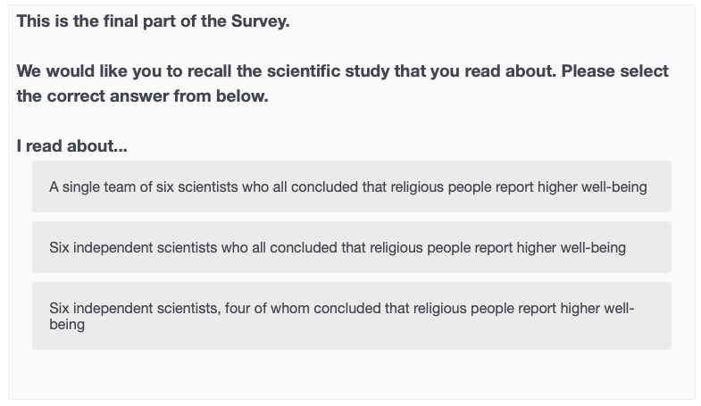
```
]

]

---
class: inverse, center, middle
name: results

# Results

---
class: left

# Participants

--

```{r, echo = FALSE, fig.retina=3, fig.align='center', out.width='110%'}
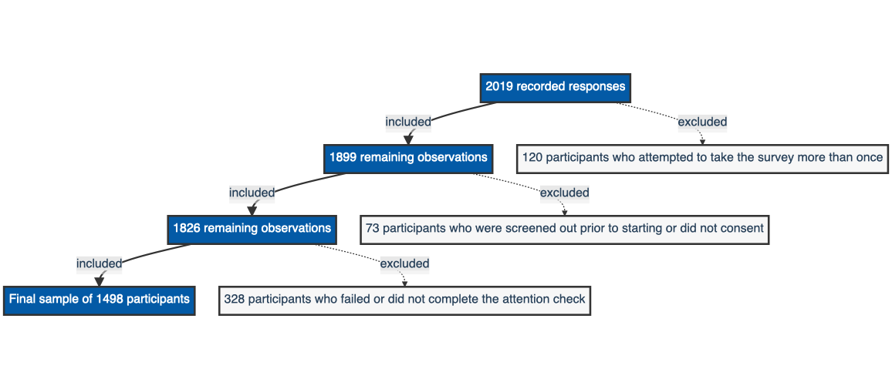
```

???

500 in the multi-consistent condition, 499 in the single-analyst and the multi-inconsistent condition

---
class: inverse, center, middle

# Main results

---
background-image: url("images/Figure1.jpg")
background-position: 50% 50%
background-size: 78%

???

Our main findings are displayed in Figure 1. Controlling for prior beliefs and comparing to the single-analyst condition, we found that (1) reported posterior beliefs were significantly lower in both the multi-consistent condition, b=-5.71, and the multi-inconsistent condition, b=-22.80; (2) ratings of credibility were significantly lower in the multi-inconsistent condition, b=-6.54, while they were not significantly different in the multi-consistent condition, b=1.24 (3) confidence in the effect size estimate was significantly lower in the multi-inconsistent condition, b=-9.09, while it was not significantly different in the multi-consistent condition, b=0.49; (4) ratings of bias were significantly greater in the multi-inconsistent condition, b=6.68, while they were not significantly different in the multi-consistent condition, b=2.13; and (5) ratings of error were significantly greater in both the multi-consistent condition, b=3.59, and the multi-inconsistent condition, b=5.89. For our exploratory measure of discretion, we found that ratings of experimenter degrees of freedom were significantly greater in both the multi-consistent condition, b=5.14, and the multi-inconsistent condition, b=9.22.

---
.center[

# Results: Multi-inconsistent

]


**In line with our hypotheses**, lay consumers of multi-analyst studies with **inconsistent** results  
--

`r icon_style(icons::fontawesome("arrow-circle-down"), scale = 1.5, fill = "red")` $~~~$ Have lower posterior beliefs  
--

`r icon_style(icons::fontawesome("arrow-circle-down"), scale = 1.5, fill = "red")` $~~~$ Find the results less credible  
--

`r icon_style(icons::fontawesome("arrow-circle-down"), scale = 1.5, fill = "red")` $~~~$ Have less confidence in the average effect size estimate  
--

`r icon_style(icons::fontawesome("arrow-circle-up"), scale = 1.5, fill = "green")` $~~~$ Believe the results are more likely to stem from bias  
--

`r icon_style(icons::fontawesome("arrow-circle-up"), scale = 1.5, fill = "green")` $~~~$ Believe the results are more likely to stem from error  
--

$~~$  
For the additional **exploratory measure**, lay consumers of multi-analyst studies with **inconsistent** results
`r icon_style(icons::fontawesome("arrow-circle-up"), scale = 1.5, fill = "green")` $~~~$ Believe the results are more likely to stem from experimenter degrees of freedom

???

In line with our hypotheses, lay consumers of multi-analyst studies with inconsistent results (compared to single-analyst studies) have lower posterior beliefs, find the results less credible, have less confidence in the average effect size estimate, and believe the results are more likely to stem from bias and error. Contrary to our hypotheses, we do not find that lay consumers of multi-analyst studies with consistent results (compared to single-analyst studies) have higher posterior beliefs, find the results more credible, have less confidence in the average effect size estimate, and believe the results are less likely to stem from bias and error: instead, they report significantly lower posterior beliefs and are more likely to believe the results stem from error (we did not find significant effects on ratings of credibility, confidence, or bias). 
---
.center[

# Results: Multi-consistent

]


**Contrary to our hypotheses**, lay consumers of multi-analyst studies with **consistent** results  
--

`r icon_style(icons::fontawesome("arrow-circle-down"), scale = 1.5, fill = "red")` $~~~$ Have lower posterior beliefs  
--

`r icon_style(icons::fontawesome("arrow-circle-up"), scale = 1.5, fill = "green")` $~~~$ Believe the results are more likely to stem from error  
--

$~~$  
We found **no significant effects** on  
--

`r icon_style(icons::fontawesome("question-circle"), scale = 1.5, fill = "grey")` $~~~$ Credibility of the results  
--

`r icon_style(icons::fontawesome("question-circle"), scale = 1.5, fill = "grey")` $~~~$ Confidence in the effect size estimate  
--

`r icon_style(icons::fontawesome("question-circle"), scale = 1.5, fill = "grey")` $~~~$ Ratings of bias  
--

$~~$  
For the additional **exploratory measure**, lay consumers of multi-analyst studies with **consistent** results
`r icon_style(icons::fontawesome("arrow-circle-up"), scale = 1.5, fill = "green")` $~~~$ Believe the results are more likely to stem from experimenter degrees of freedom


???

In line with our hypotheses, lay consumers of multi-analyst studies with inconsistent results (compared to single-analyst studies) have lower posterior beliefs, find the results less credible, have less confidence in the average effect size estimate, and believe the results are more likely to stem from bias and error. Contrary to our hypotheses, we do not find that lay consumers of multi-analyst studies with consistent results (compared to single-analyst studies) have higher posterior beliefs, find the results more credible, have less confidence in the average effect size estimate, and believe the results are less likely to stem from bias and error: instead, they report significantly lower posterior beliefs and are more likely to believe the results stem from error (we did not find significant effects on ratings of credibility, confidence, or bias). 

---
background-image: url("images/Figure2.jpg")
background-position: 50% 50%
background-size: 78%

???

Note.  Prior beliefs are displayed in blue; posterior beliefs are displayed in orange. The respective boxes display the lower quartiles, medians, and upper quartiles of prior and posterior beliefs by condition.

It is worth noting on the basis of Figure 2 and a post-hoc, paired t-test that, while multi-analyst studies with consistent results perform worse or no better than single-analyst studies on all measures, there is a significant, positive effect of the findings on posterior beliefs within the multi-consistent condition: i.e., beliefs in the research hypothesis are greater after reading the multi-consistent study results, M_d=4.75, p<.001. This finding clarifies that multi-analyst studies are not necessarily bad in absolute terms — however, when comparing to conventional, single-analyst scientific research, crowdsourced data analysis does not seem to provide an improvement in the sway and credibility of scientific research to lay consumers.

---

class: inverse, center, middle
name: discussion

# Discussion

---

# Conclusion

`r icon_style(icons::fontawesome("route"), scale = 1.5, fill = "#035AA6")`   $~~~$ Crowdsourced data analysis has **many worthy uses**  
--

`r icon_style(icons::fontawesome("exclamation-triangle"), scale = 1.5, fill = "#035AA6")` $~~$ However, scientific reform may have **unintended consequences**   
--

`r icon_style(icons::fontawesome("users-slash"), scale = 1.4, fill = "#035AA6")` $~~$ Do lay consumers respond negatively to **variability** and  **lack of consensus**?   
--

## Future directions
`r icon_style(icons::fontawesome("flask"), scale = 1.5, fill = "#035AA6")` $~~$ Perceptions of **scientists**?  
--

`r icon_style(icons::fontawesome("comments"), scale = 1.5, fill = "#035AA6")` $~$ Importance of **science communication** and **communicating uncertainty**  
--

`r icon_style(icons::fontawesome("lightbulb"), scale = 1.5, fill = "#035AA6")` $~~~$ Other **suggestions**?

???

From the proliferation of big team science and large-scale replication initiatives to preregistration and registered reports, several scientific fields have undergone significant reform with the well-intended goal of improving the reliability of scientific research. The multi-analyst approach comes with many worthy uses, from demonstrating the arbitrariness and impact of individual analytic choices to acknowledging the inherent variability of results and averaging across idiosyncratic analytic choices to obtain more accurate parameter estimates. However, as with any real-world intervention, scientific reform can have unintended consequences. Here, we focus on the effects of crowdsourcing data analysis, and find that the multi-analyst approach may have an unintended consequence.
While partly instituted with the goal of improving the credibility of scientific research (as shown in Table 1), lay consumers appear to resist the variability and lack of consensus that often comes with multi-analyst research. To our surprise, even when results generated by independent analysts are largely consistent, lay consumers are less likely to believe in the reported phenomenon and more likely to think that the findings stem from error and experimenter degrees of freedom.

---
class: inverse, center, middle

# Thank you! 


